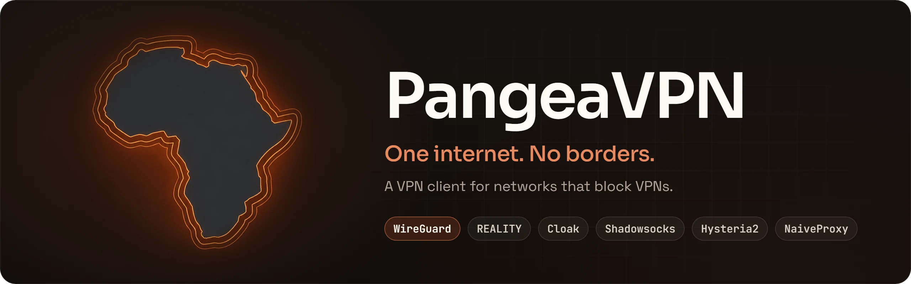
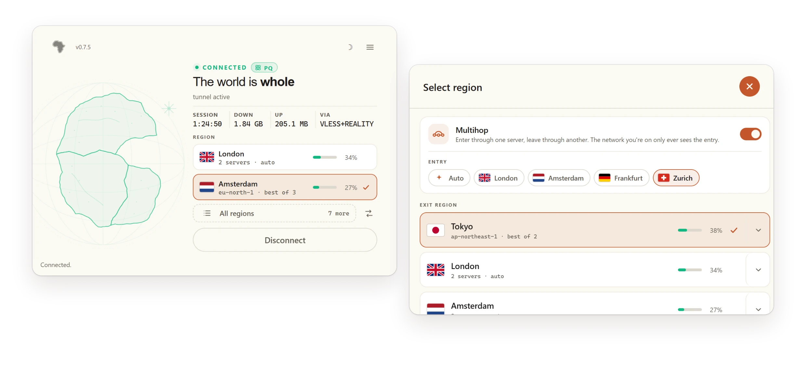
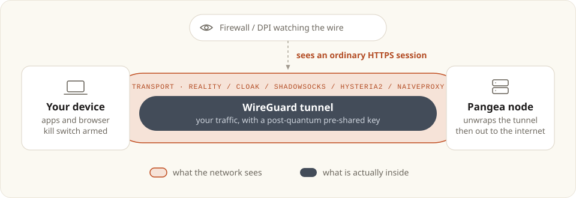
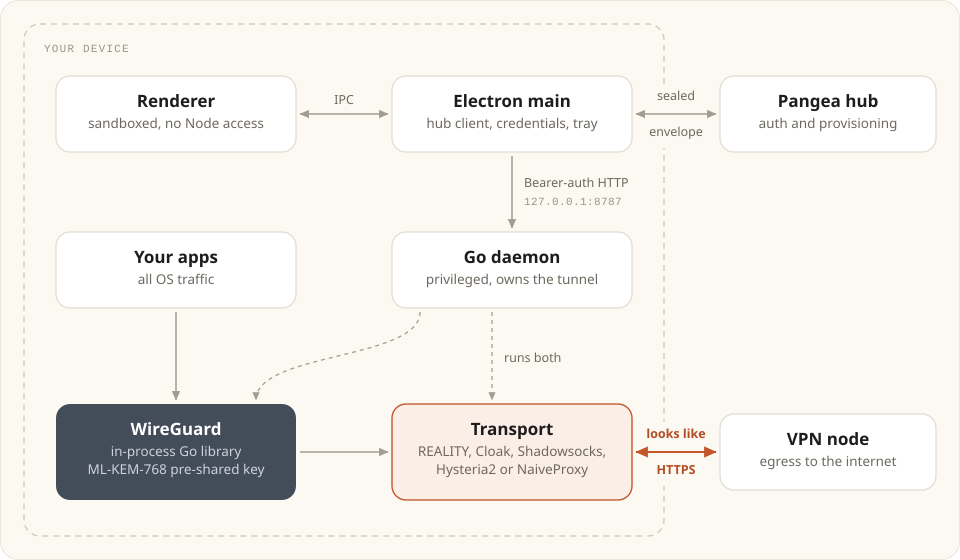

<div align="center">



An open-source VPN client for networks that block VPNs. It runs WireGuard inside<br/>
five censorship-resistant transports, so the tunnel looks like ordinary HTTPS.

[](https://github.com/pangeavpn/pangeavpn-app/releases/latest)
[](https://github.com/pangeavpn/pangeavpn-app/actions/workflows/build-desktop.yml)
[](LICENSE)
[](#install)
[](#languages)
[](https://pangeavpn.org)

[Install](#install) · [Transports](#transports) · [How it works](#how-it-works) · [Verify your download](#verify-your-download) · [Security](#security) · [Build from source](#build-from-source) · [Docs](#documentation)

<br/>

<picture>
  <source media="(prefers-color-scheme: dark)" srcset="docs/assets/showcase-dark.webp" />
  
</picture>

</div>

---

## What this is

PangeaVPN is a desktop VPN client for Windows, macOS and Linux. It's made for networks that go looking for VPNs and block them: national firewalls, ISP-level DPI, corporate filters, captive Wi-Fi, hotel networks.

It runs WireGuard entirely in-process and wraps it in an obfuscation transport, so what crosses the wire looks like a normal HTTPS session instead of a recognisable VPN handshake. If one transport gets blocked, the client moves on to the next by itself.

> [!NOTE]
> **The client is open source. The network is a paid service.**
> The app in this repository is GPL-3.0, and yours to read, build, fork and audit. Connecting to the Pangea network needs an account: there's a 5-day free trial with no card required, then plans from £2.33/month. Monero is accepted and you don't need to give an email. See [pangeavpn.org/pricing](https://pangeavpn.org/pricing).
>
> The client speaks a documented HTTP API, so you could point it at your own infrastructure, but that isn't a supported path yet.

## Why it exists

Most VPNs give themselves away somehow: an odd port, a WireGuard handshake signature, a TLS fingerprint that doesn't match any real browser. Deep packet inspection spots these and drops the connection. Worse, once a protocol has been fingerprinted, everyone using it goes down at the same moment.

PangeaVPN doesn't bet on one obfuscation scheme holding up forever. The daemon carries several and falls back between them on its own, so blocking one doesn't take you offline.

## Transports

In auto mode the daemon works down this list until one connects. You can also pin a single transport.

| # | Transport | What the network sees |
|:-:|---|---|
| 1 | **VLESS + REALITY** | A TLS handshake that borrows a real third-party site's certificate |
| 2 | **Cloak** | A TLS session to a harmless-looking web host |
| 3 | **Shadowsocks** | An encrypted stream on its own port with no TLS shape at all, so a block aimed at the two above doesn't touch it |
| 4 | **Hysteria2** | QUIC / HTTP-3, hard to tell apart from modern web traffic |
| 5 | **NaiveProxy** | Traffic carrying a genuine Chrome TLS fingerprint |

Cloak is always available. The others switch on when the hub provisions them, so your exact cascade depends on your account and the node you land on.

The client also remembers which transport worked on each network and puts it first the next time you connect there. A network that blocks REALITY only costs you the fallback delay once.

Whichever transport comes up, the tunnel inside it is always WireGuard, and it never shells out to `wg`, `wg-quick` or any other external binary. You can also pick **plain WireGuard** with no transport at all. It's the fastest option and the only one that is recognisable on the wire as a VPN, which is why auto mode never chooses it.

A Snowflake transport (WebRTC, as used by Tor) is written and wired up but switched off in current releases, because its peer address is only discovered at runtime and the kill switch can't permit it in advance. See `snowflakeReleaseGated` in [`daemon/internal/api/service.go`](daemon/internal/api/service.go).

## Features

| | |
|---|---|
| **Five transports, automatic fallback** | Blocking one doesn't take you offline, and the client remembers what worked on each network |
| **WireGuard core** | Modern crypto, low latency, fully in-process |
| **Post-quantum tunnel keys** | An ML-KEM-768 exchange sets WireGuard's pre-shared key, so breaking X25519 later isn't enough to decrypt traffic recorded today |
| **Multihop** | Enter through one server and leave through another. The network you're on only ever sees the entry |
| **Kill switch** | OS firewall rules block traffic if the tunnel drops (Windows WFP, Linux nftables/iptables, macOS PF) |
| **Lockdown mode** | Optionally keeps the kill switch armed after you disconnect |
| **Split tunnelling** | Pick apps or IPv4 ranges that skip the VPN, with no kernel driver. DNS always stays in the tunnel |
| **Encrypted hub channel** | Each request is sealed with hybrid X25519 + ML-KEM-768 and AES-256-GCM, so it survives proxies that intercept TLS |
| **Hub access when blocked** | Cached IP, DNS-over-HTTPS, REALITY, Shadowsocks and a CDN relay, then a signed dead drop if every known address has been burned |
| **8 languages** | Including Persian, Arabic, Chinese, Russian and Ukrainian |
| **Native desktop** | Compact taskbar popover, dark and light themes, system tray, auto-start at login |
| **Real installers** | NSIS on Windows, an installer `.dmg` that sets up launchd on macOS, AppImage and `.deb` on Linux |

## Languages

English · Español · Français · Русский · Українська · 中文 · العربية · فارسی

Translation fixes are welcome. The locale files are in [`apps/desktop/src/renderer/i18n/locales/`](apps/desktop/src/renderer/i18n/locales/).

## Install

Download from [pangeavpn.org/download](https://pangeavpn.org/download) or the [Releases](../../releases) page.

| Platform | Download | Notes |
|---|---|---|
| Windows 10/11 (x64, arm64) | `Setup.exe` (NSIS) | Installs `PangeaDaemon` as a Windows service, so you aren't prompted every time you connect |
| macOS (Intel, Apple Silicon) | installer `.dmg` | Holds the `.pkg` and `install-mac.sh`. The script installs the app and registers the launchd daemon, so there are no password prompts at runtime |
| Linux (x64, arm64) | build from source | `./scripts/install-linux.sh` installs the app and a systemd service |

Release builds cover Windows and macOS. On Linux, `npm run build-bin:linux` also produces an AppImage and a `.deb`, but neither of those sets up the daemon service by itself.

### macOS one-command install

```bash
curl -fsSL https://pangeavpn.org/install-mac.sh | bash
```

> [!CAUTION]
> This pipes a remote script into a root shell. That's fine for developers, but we'd rather you read [`scripts/install-mac.sh`](scripts/install-mac.sh) first. The installer `.dmg` on the Releases page bundles the same script next to the `.pkg`. Installing the `.pkg` on its own leaves out the background service.

### Linux from source

```bash
git clone https://github.com/pangeavpn/pangeavpn-app.git
cd pangeavpn-app
./scripts/install-linux.sh
```

## Verify your download

> [!WARNING]
> **Releases are not code-signed yet.** We'd rather tell you here than have you find out from a SmartScreen or Gatekeeper prompt.

A code-signing certificate needs either a registered legal entity or an annual fee the project doesn't cover right now. It's on the roadmap. Until then, Windows will show *"Windows protected your PC"* (click **More info → Run anyway**) and macOS will warn that it can't verify the developer.

You don't have to take our word for anything:

- **Check the hash.** Every release publishes a `SHA256SUMS.txt` with a checksum for each file. Compare before installing:

  ```bash
  # macOS / Linux
  shasum -a 256 PangeaVPN-Setup-*.exe
  ```

  ```powershell
  # Windows
  Get-FileHash .\PangeaVPN-Setup-*.exe -Algorithm SHA256
  ```

- **Check where it was built.** Every release file comes out of [GitHub Actions](.github/workflows/build-desktop.yml) from the tagged commit, in public, with public logs.
- **Build it yourself.** See [Build from source](#build-from-source). Then you don't have to trust our binaries at all.
- **Read the code.** That's what the licence is for.

The bundled `wintun.dll` and `wireguard.dll` are the official Authenticode-signed builds from WireGuard LLC. We don't rebuild them.

## How it works

<picture>
  <source media="(prefers-color-scheme: dark)" srcset="docs/assets/how-it-works-dark.svg" />
  
</picture>

1. **You sign in.** The app seals the request under the hub's pinned keys, with a fresh key per request, and POSTs it to the hub.
2. **The hub provisions a peer** on the best node and sends back a WireGuard config and transport credentials over the same encrypted channel.
3. **The local daemon builds the tunnel.** It works through the transport list until one connects, brings WireGuard up over it, and routes your traffic in.
4. **The kill switch arms**, so a dropped tunnel can't leak your real IP.

On a normal connection all four steps finish in well under a second.

## Architecture

<picture>
  <source media="(prefers-color-scheme: dark)" srcset="docs/assets/architecture-dark.svg" />
  
</picture>

Three components live in one repo:

- **`apps/desktop`**: Electron and TypeScript, with vanilla HTML/CSS and no framework. The sandbox is on, context isolation is on, and the renderer has no Node access.
- **`daemon`**: a Go HTTP daemon on `127.0.0.1:8787` with Bearer token auth, rate limiting, a 1 MB body cap and sanitised errors. It owns the state machine and the in-process WireGuard and transport managers.
- **`packages/shared-types`**: the Zod schemas shared between Electron and the daemon-facing TypeScript.

[docs/architecture.md](docs/architecture.md) goes into the details.

### Platform implementations

| Platform | WireGuard | Transports | Daemon model | Kill switch |
|---|---|---|---|---|
| Windows | In-process (`wireguard/windows` + Wintun) | In-process | Windows service (LocalSystem) | WFP filters |
| macOS | In-process (Go library + utun) | In-process | launchd system daemon | PF rules |
| Linux | In-process (Go library + TUN, policy routing + fwmark) | In-process | systemd service | nftables, falling back to iptables |

No platform spawns an external `wg`, `wg-quick`, `wireguard-go` or `ck-client` binary, and [`daemon/internal/wg/no_exec_test.go`](daemon/internal/wg/no_exec_test.go) fails the build if anything tries.

## Security

PangeaVPN is open source so you can check every claim below instead of believing it.

### Encrypted hub channel

The app talks to the hub over its own encrypted channel *inside* HTTPS. The threat model includes captive portals and corporate proxies that intercept TLS on purpose, so the outer TLS can't be the thing you rely on.

For each request, the app:

1. generates a fresh X25519 key pair and runs ECDH against the hub's pinned X25519 key;
2. asks the local daemon for an ML-KEM-768 encapsulation to the hub's second pinned key;
3. feeds both secrets through HKDF-SHA256 to get separate AES-256 keys for each direction;
4. encrypts the inner `{method, route, headers, body}` with AES-256-GCM, binding the reply to the request it answers;
5. sends it to `/v2/secure`, where only an allowlist of client-facing routes is reachable.

If the daemon can't encapsulate, the request falls back to X25519 alone on `/v1/secure`. Only the local daemon makes that call, so nothing on the network can force the downgrade. [docs/post-quantum.md](docs/post-quantum.md) covers both the channel and the tunnel keys.

> [!IMPORTANT]
> **About `rejectUnauthorized: false`.** Yes, the outer TLS layer skips CA validation, and yes, that's deliberate. On a network where a middlebox already terminates and re-signs TLS, validation either fails outright or passes against the middlebox's own certificate, and neither result tells you anything. The trust anchors are the pinned hub keys. Without the matching private keys an interceptor can't read or forge the inner payload, whatever it does to the outer TLS. Please read [docs/architecture.md](docs/architecture.md) before proposing a change here.

### Electron hardening

- `sandbox: true` and `contextIsolation: true` on the renderer
- Strict CSP: `default-src 'self'`, `object-src 'none'`, `base-uri 'none'`, `frame-src 'none'`, `form-action 'none'`
- The main process blocks navigation, `window.open` and webview tags
- Permission requests are denied by default, TLS errors are fatal in production, and DevTools are off in packaged builds
- Electron Fuses: `runAsNode` off, `enableNodeOptionsEnvironmentVariable` off, `enableNodeCliInspectArguments` off, cookie encryption on, `onlyLoadAppFromAsar` on
- Credentials live in the OS keychain through `safeStorage`
- The renderer builds its DOM with `createElement` and `textContent`, never `innerHTML` on user-controlled data

### Daemon hardening

- Every endpoint except `/ping` needs the Bearer token
- The token file is `0600`, machine-scoped (`%ProgramData%`) for the Windows service and user-scoped elsewhere
- Token-bucket rate limit (2000 burst, refilling at about 33/s), a 1 MB request cap, and sanitised error messages
- It listens on loopback only and never binds a network interface. Requests with a non-loopback `Host` or `Origin` are refused, so a web page can't reach it

### Reporting a vulnerability

Please report security issues privately through [pangeavpn.org/contact](https://pangeavpn.org/contact) instead of opening a public issue.

## Build from source

### Prerequisites

- **Node.js LTS** and npm
- **Go 1.25+** on `PATH`, or a prebuilt daemon at `daemon/bin/PangeaDaemon.exe` / `daemon/bin/daemon`
- The platform's installer toolchain: NSIS on Windows, Xcode Command Line Tools on macOS, `dpkg`/`fakeroot` for `.deb`
- For NaiveProxy, cgo and a C toolchain. Without the `naive_cgo` build tag it compiles to a stub that reports itself unavailable

### Run in dev

```bash
npm install
npm run dev
```

> [!TIP]
> On Windows the dev script asks for UAC so the daemon can configure the WireGuard adapter.

### Commands

| Command | What it does |
|---|---|
| `npm run dev` | UI and daemon, rebuilt on change and wired together |
| `npm run build` | Compile `shared-types`, then the desktop app, then the daemon |
| `npm test` | TypeScript and Go test suites |
| `npm run build-bin:windows` | NSIS installer (x64 + arm64) |
| `npm run build-bin:mac` | `.pkg` and installer `.dmg` for Intel and Apple Silicon |
| `npm run build-bin:linux` | AppImage and `.deb` (x64 + arm64) |
| `npm run build-bin` | All three, in sequence |

[docs/binaries-and-packaging.md](docs/binaries-and-packaging.md) has the per-platform details.

<details>
<summary><strong>Project layout</strong></summary>

```
apps/desktop/           Electron app (TypeScript, vanilla HTML/CSS)
  src/main/             Main process: IPC, daemon client, secure channel, auth, updater
  src/renderer/         UI + i18n locales
  src/shared/           IPC channel constants and shared helpers
daemon/                 Go daemon
  cmd/daemon/           Entry point + Windows service host
  internal/api/         HTTP handlers (rate-limited, sanitised)
  internal/auth/        Bearer token management
  internal/state/       State machine, config store, log store
  internal/cloak/       In-process Cloak runtime
  internal/naive/       NaiveProxy transport (cgo)
  internal/pq/          ML-KEM-768 key exchange
  internal/wg/          In-process WireGuard manager (build-tagged per OS)
  internal/platform/    Paths, kill switch, routes, WFP
packages/shared-types/  Zod schemas + TS types shared by both halves
infra/edge-relay/       Cloudflare Worker that relays the hub envelope
scripts/                Dev + packaging scripts (Node MJS)
docs/                   Architecture and packaging deep-dives
```

</details>

## Documentation

| Document | What's in it |
|---|---|
| [Architecture](docs/architecture.md) | Trust boundaries, the local API, reaching the hub, the connection lifecycle, the kill switch and the health loop |
| [Binaries and packaging](docs/binaries-and-packaging.md) | Build prerequisites, installer contents, service setup and release CI |
| [Post-quantum protection](docs/post-quantum.md) | The ML-KEM-768 exchange behind WireGuard's pre-shared key and the `/v2/secure` channel |
| [Dead-drop bootstrap](docs/deaddrop-bootstrap-design.md) | How a client that can't reach the hub learns new addresses from a signed public file |
| [Edge relay](infra/edge-relay/README.md) | The CDN relay behind the `fronted` hub method, and how to deploy one |

## Roadmap

Roughly in priority order:

- **Mobile clients** for Android and iOS. This is the biggest gap by far.
- **Code-signed releases** on Windows and macOS.
- **Auto-connect rules** for untrusted Wi-Fi, on boot, and after leaving a captive portal.
- **Snowflake.** It's written but not switched on in production yet.
- **SNI rotation and domain fronting**, to get past single-fingerprint blocks.
- **Reproducible builds**, so anyone can confirm a release matches this source.
- **Kernel WireGuard** on Windows and Linux, for gigabit throughput.

## Contributing

PRs and issues are welcome. A few things to know first:

- Keep one commit per logical change. It's easier to review and easier to revert.
- Don't change `rejectUnauthorized` on the secure channel. It's deliberate; if it looks wrong, read [docs/architecture.md](docs/architecture.md) first.
- Don't shell out to `wg`, `wireguard-go` or `ck-client`. Everything runs in-process for a reason, and `no_exec_test.go` enforces it.
- Run `npm test` before you open a PR.

## Links

- Website: [pangeavpn.org](https://pangeavpn.org)
- Privacy policy: [pangeavpn.org/legal/privacy](https://pangeavpn.org/legal/privacy)
- Warrant canary: [pangeavpn.org/canary](https://pangeavpn.org/canary)

## License

[GPL-3.0](LICENSE). If you ship a fork, ship the source.
