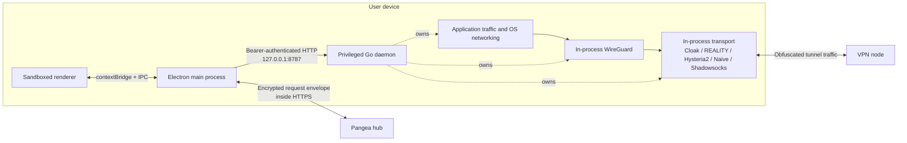
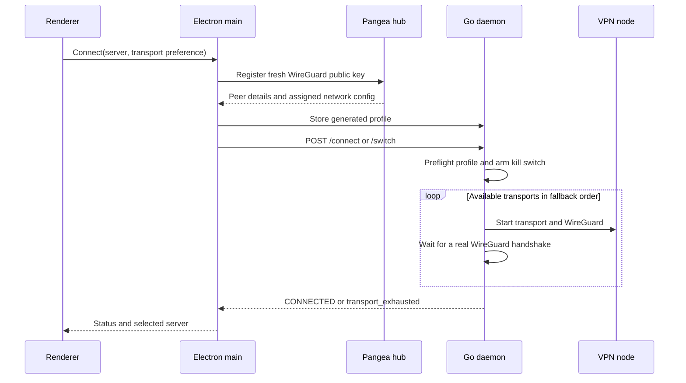
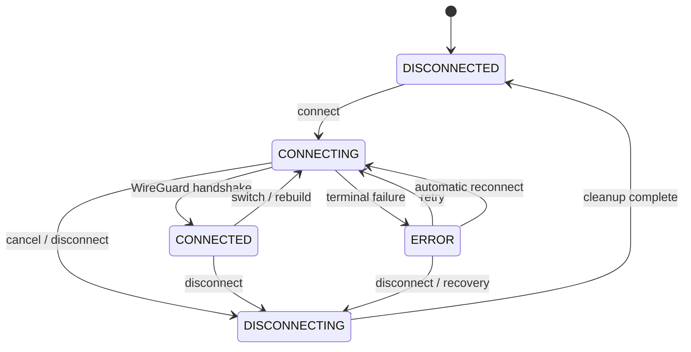

# Architecture

PangeaVPN is a desktop VPN client with a sandboxed Electron interface and a
privileged Go daemon. The Electron app owns user interaction and the remote
control plane; the daemon owns tunnel setup, transport selection, routing, DNS,
and leak prevention.

> [!NOTE]
> This document describes the client repository. The Pangea hub and VPN-node
> implementations live elsewhere, so server-side behavior is only described
> where the client contract makes it observable.

## At a glance

| Layer | Location | Responsibility |
| --- | --- | --- |
| Renderer | [`apps/desktop/src/renderer`](../apps/desktop/src/renderer) | UI, localization, user intent, and connection presentation |
| Preload bridge | [`apps/desktop/src/main/preload.ts`](../apps/desktop/src/main/preload.ts) | Narrow `contextBridge` API over asynchronous Electron IPC |
| Electron main | [`apps/desktop/src/main`](../apps/desktop/src/main) | Hub access, credentials, provisioning, daemon client, tray, updater, and recovery |
| Shared TypeScript contracts | [`packages/shared-types`](../packages/shared-types) | Zod schemas and inferred compile-time types used by the Electron application |
| Privileged daemon | [`daemon`](../daemon) | Local API, state machine, transports, WireGuard, routes, DNS, and kill switch |
| Remote services | Pangea infrastructure | Authentication, node discovery, peer provisioning, and VPN egress |

The TypeScript schemas are not shared with Go at compile time or enforced as
runtime validation by the daemon client. Go request structures live in
[`daemon/internal/api/server.go`](../daemon/internal/api/server.go), with profile
and status structures in
[`daemon/internal/state/types.go`](../daemon/internal/state/types.go). Keep both
sides aligned when changing the local API.

## System overview



There are two distinct paths:

- **Control plane:** renderer to Electron main to the local daemon or remote hub.
- **Data plane:** operating-system traffic to WireGuard to the selected
  censorship-resistant transport to the VPN node.

## Trust and privilege boundaries

### Renderer

The renderer runs with `sandbox: true`, `contextIsolation: true`, and
`nodeIntegration: false`. It cannot import Node.js APIs directly. Navigation,
new windows, webviews, and permission requests are restricted by the main
process, and the renderer is protected by a restrictive Content Security
Policy.

The preload script exposes only named operations such as status, connect,
disconnect, authentication, settings, and update actions. Calls cross into the
main process with `ipcRenderer.invoke()`.

Relevant code:

- [`main.ts`](../apps/desktop/src/main/main.ts)
- [`preload.ts`](../apps/desktop/src/main/preload.ts)
- [`ipc.ts`](../apps/desktop/src/shared/ipc.ts)
- [`index.html`](../apps/desktop/src/renderer/index.html)

### Electron main process

The main process is the unprivileged coordinator. It:

- stores and restores hub authentication;
- encrypts requests to the Pangea hub;
- provisions a fresh WireGuard peer for a selected server;
- writes generated profiles to the daemon;
- handles server fallback and connect cancellation;
- monitors daemon health and attempts platform-appropriate recovery;
- owns the tray, login-item, update, and network-change integrations.

It does not configure network interfaces or firewall rules itself.

### Go daemon

The daemon runs with the privileges needed to create a TUN interface and alter
system networking. It binds only to `127.0.0.1:8787` and requires a local Bearer
token on every endpoint except `/ping`.

The token prevents unauthenticated requests but should not be treated as a
strong boundary between users on the same machine: service installs make the
token readable by the desktop app. Profiles in `config.json` contain sensitive
WireGuard and transport credentials and are not application-level encrypted.

## Local daemon API

[`daemonClient.ts`](../apps/desktop/src/main/daemonClient.ts) is the Electron
client for the HTTP API registered in
[`daemon/internal/api/server.go`](../daemon/internal/api/server.go).

| Method | Route | Purpose |
| --- | --- | --- |
| `GET` | `/ping` | Unauthenticated liveness check |
| `GET` | `/status` | State, active transport, WireGuard counters, and kill-switch status |
| `POST` | `/connect` | Connect with a selected profile and transport preference |
| `POST` | `/disconnect` | Stop the tunnel, optionally retaining Lockdown |
| `POST` | `/switch` | Replace an active profile without dropping the kill switch first |
| `POST` | `/killswitch/engage` | Engage Lockdown while disconnected |
| `POST` | `/killswitch/permit` | Permit hub control-plane IPv4 addresses through Lockdown |
| `POST` | `/killswitch/clear` | Clear an inactive-session lock |
| `GET` | `/logs?since=<id>` | Read in-memory daemon log entries |
| `GET`, `POST` | `/config` | Read or replace stored profiles |

Body-bearing routes are limited to 1 MiB, requests are rate-limited, Bearer
tokens are compared in constant time, and handler errors are sanitized before
they cross the API boundary.

## Remote control plane

The main process uses
[`pangeaApiClient.ts`](../apps/desktop/src/main/pangeaApiClient.ts) for hub
requests. Current client operations include token login, bootstrap, regions,
subscription, device registration, device management, and peer registration.

### Secure request envelope

Hub payloads use an encrypted channel implemented in
[`secureChannel.ts`](../apps/desktop/src/main/secureChannel.ts):

1. Generate a fresh ephemeral X25519 client key pair.
2. Derive a shared secret against the pinned static hub public key.
3. Derive a 32-byte key with HKDF-SHA256.
4. Encrypt `{ method, route, headers, body }` with AES-256-GCM.
5. Send `{ eph, iv, ct, tag }` to `/v1/secure` over HTTPS.
6. Decrypt and authenticate the encrypted response with the same derived key.

The pinned key authenticates the encrypted application payload independently of
the transport carrying it. That is what lets the client take paths where the
outer TLS session proves nothing: direct-IP/no-SNI requests disable certificate
verification, and the fronted path runs through a relay that terminates TLS
itself. Neither can read or forge an envelope.

> [!IMPORTANT]
> This is ephemeral-static ECDH, not full forward secrecy. A later compromise of
> the hub's static private key could expose previously recorded request
> envelopes. The pinned public key also requires a client update to rotate.

The remote route allowlist and server-side cryptographic handling are outside
this repository and must not be inferred from the client alone.

### Reaching the hub

`ensureHub` tries each enabled method in order, keeping the first that completes
an encrypted probe. Each is a switch the user can turn off; at least one must
stay on.

| # | Method | Defeats |
|---|---|---|
| 1 | Cached hub IP, no SNI | DNS entirely — no lookup, so it is the only method that survives an engaged Lockdown lock |
| 2 | DoH-resolved IP, no SNI | DNS poisoning, and SNI-based blocking |
| 3 | Daemon's Shadowsocks proxy | A blackholed hub IP |
| 4 | Edge relay | Enumeration of our address space, which takes out 1–3 at once |
| 5 | Plain HTTPS to the domain | Nothing; it is the baseline |

Methods 1–3 all terminate on address space we own, so a censor who enumerates
and null-routes our IPs defeats every one of them together. Method 4 exists for
exactly that case: the relay answers on CDN anycast space shared with a large
part of the web, where a block costs the censor real collateral. It is attempted
after our own paths because it tells a third party the timing of our traffic —
never its content. See [`infra/edge-relay`](../infra/edge-relay).

Method 5 is last because it is the only one that puts the hub's hostname on the
wire in cleartext. When it is switched off and everything else has failed,
`ensureHub` throws rather than falling back to it.

Relays and control-plane Shadowsocks credentials are cached to `settings.json`
as the hub advertises them, and the client promotes whichever last worked. The
fronted method is inert until a relay is configured, the same way the
Shadowsocks method is inert until credentials are cached.

### Connecting with no hub at all

Provisioning needs the hub: `provision()` registers a fresh WireGuard key at
`/api/register`, so a cached node list alone cannot produce a working profile.

Two caches cover the gap. The node list is persisted, so a cold start behind a
block still has servers to show and a retry plan to build. And when provisioning
fails on a reachability error, `provisionAndConnect` falls back to the profile
the daemon already holds — its WireGuard key was registered on an earlier run,
which makes it the one way to reach a node while the hub is unreachable.

The fallback is skipped for auth and subscription failures: those are the hub
answering, and the peer that profile names will already have been deprovisioned.
Switching has no equivalent fallback, because a switch that cannot reach the hub
unwinds to the connection the user already had.

## Connection lifecycle

The Electron app and daemon deliberately split provisioning from tunnel setup.



### Provisioning and server fallback

For each server candidate, the main process:

1. generates a fresh WireGuard key pair;
2. registers the public key with the hub;
3. builds an `auto-<serverId>` daemon profile;
4. stores the profile through `/config`;
5. calls `/connect`, or `/switch` when replacing an active connection.

If every eligible transport fails in automatic mode, the main process may try
the next server in its finite fallback plan. Cancellation and terminal failures
restore the original daemon profile snapshot. See
[`connectAttempt.ts`](../apps/desktop/src/main/connectAttempt.ts) and
[`serverFallback.ts`](../apps/desktop/src/main/serverFallback.ts).

### Transport fallback

The daemon's automatic preference is:

1. VLESS + REALITY
2. Cloak
3. Shadowsocks
4. Hysteria2
5. NaiveProxy
6. Snowflake

Only transports configured in the selected profile are candidates. Cloak is
required by the current profile model. Snowflake is implemented but removed
from release candidates by `snowflakeReleaseGated`. NaiveProxy is available only
when the daemon was built with its native CGO engine; otherwise a stub reports
it as unavailable.

A remembered last-good transport for the current network can be promoted to the
front of the list. Every candidate must start successfully and complete a real
WireGuard handshake within the connection deadline. Failed candidates are torn
down before the next one starts.

The user may also select one transport instead of automatic mode, which disables
fallback entirely: that transport is the only candidate, and a profile with no
configuration for it is refused rather than downgraded.

### Plain WireGuard

Selecting `wireguard` connects with no transport at all. The profile's
`wireguard.directEndpoint` (the node's own UDP listener, as the hub reported it)
replaces the loopback `Endpoint` in the config text, and nothing else about the
session changes — same kill switch, same handshake gate, same health checks and
recovery. It is the fastest and lowest-overhead method and the only one that is
recognizable on the wire as a VPN, so the automatic cascade never selects it and
a direct session is never recorded as the network's last-good transport.

The orchestration lives in
[`daemon/internal/api/service.go`](../daemon/internal/api/service.go).

## Data plane

```text
Application traffic
  -> OS routes
  -> WireGuard TUN (in-process)
  -> WireGuard UDP to a loopback transport listener
  -> selected transport (in-process)
  -> remote transport endpoint
  -> VPN node and internet egress
```

| Transport | Implementation | Release status |
| --- | --- | --- |
| Cloak | [`daemon/internal/cloak`](../daemon/internal/cloak) using the Pangea Cloak Go module | Enabled; baseline transport |
| VLESS + REALITY | [`daemon/internal/reality`](../daemon/internal/reality) using embedded sing-box/uTLS | Enabled when provisioned |
| Hysteria2 | [`daemon/internal/hysteria2`](../daemon/internal/hysteria2) using embedded sing-box/QUIC | Enabled when provisioned |
| NaiveProxy | [`daemon/internal/naive`](../daemon/internal/naive) with a CGO-linked native engine and in-process relay | Windows/macOS builds when native inputs resolve; release CI requires it |
| Shadowsocks | [`daemon/internal/shadowsocks`](../daemon/internal/shadowsocks) using embedded sing-box (AEAD / SS-2022) | Enabled when provisioned |
| Snowflake | [`daemon/internal/snowflake`](../daemon/internal/snowflake) using the Tor Snowflake library | Implemented but release-gated |
| Plain WireGuard | None — the tunnel dials the node directly, skipping the loopback listener above | Enabled on explicit user selection only |

No separate `wg`, `wg-quick`, `wireguard-go`, Cloak, or NaiveProxy tunnel
process is launched. "In-process" applies to tunnel engines, not every platform
operation: macOS and firewall backends still invoke standard operating-system
networking tools where required.

## WireGuard and platform networking

The daemon imports wireguard-go as a library on every supported platform. The
current tunnel is IPv4-only: IPv6 interface addresses, DNS servers, and
`AllowedIPs` are rejected, while the kill switch blocks non-loopback IPv6.

| Platform | Tunnel and network setup | Kill switch | Managed daemon model |
| --- | --- | --- | --- |
| Windows | In-process WireGuard TUN; `winipcfg` configures addresses, routes, DNS, and endpoint bypasses | Windows Filtering Platform (WFP) | `PangeaDaemon` automatic LocalSystem service |
| macOS | In-process utun; `ifconfig`, `route`, and `networksetup` apply address, route, and DNS changes | PF anchor through `pfctl` | Root `launchd` daemon when installed with `install-mac.sh` |
| Linux | In-process TUN; netlink plus routing table/fwmark `51820`; systemd-resolved D-Bus or `/etc/resolv.conf` for DNS | nftables with iptables/ip6tables fallback | Root systemd service when installed with `install-linux.sh` |

Platform code lives in:

- [`daemon/internal/wg`](../daemon/internal/wg)
- [`daemon/internal/platform`](../daemon/internal/platform)

Known transport endpoint addresses and hub control-plane addresses are routed
outside the tunnel to prevent recursion and preserve recovery traffic.

## Kill switch and Lockdown

The daemon engages the kill switch **before** starting a transport or WireGuard.
Initial rules permit only the traffic needed to establish the tunnel, including
loopback, configured transport endpoints, hub bypass addresses, DHCP, and
optional LAN ranges. After a successful handshake, the active tunnel interface
is permitted.

This ordering makes connection failure fail closed: if every transport fails,
the kill switch remains active until disconnect or explicit recovery clears it.

The lock also covers traffic the host forwards for guests (WSL2, Hyper-V NAT,
Docker, libvirt), which never reaches the socket-level rules: Windows blocks at
the `IPFORWARD` layers and permits forwarding only onto the tunnel interface,
nftables and iptables carry a `forward` chain beside `output`. Bridged
frames between containers on one bridge keep working; VMs bridged directly onto
the physical NIC sit below the host stack and cannot be covered on any platform.

At boot the lock has to be back before the network is: Windows installs
boot-time twins of the persistent filters for the window before the Base
Filtering Engine starts, Linux runs `pangea-killswitch-boot.service` before
`network-pre.target`, and macOS enables pf from a LaunchDaemon while a
kill-switch anchor is on disk.

Allow LAN opens the local ranges but not their resolvers: DNS and DNS-over-TLS
(ports 53 and 853) to a LAN address stay blocked on every platform, since a
router that forwards lookups upstream is a DNS leak. A resolver the profile
itself names is routed into the tunnel, so it needs no permit of its own. On
macOS the pf anchor also blocks unsolicited inbound traffic, admitting loopback,
the DHCP reply, and the LAN under Allow LAN, and flushes pf's state table when
the lock first lands so connections established earlier cannot outlive it.

While a session runs, the local permit endpoint accepts only addresses a stored
profile already carries (the hub and the transports the hub handed out); any
other address is refused, since the hub is reachable through the tunnel then.

Lockdown mode intentionally retains the kill switch after disconnect and records
that intent in `killswitch-state.json`. The retained lock keeps only the hub
permitted: the departing server's endpoints and the dead tunnel's interface
permit both come out, since macOS reuses utun numbers and Windows can reuse an
interface index. On startup, the daemon distinguishes an intentional lock from
stale firewall state, attempts to adopt an existing tunnel, and cleans up stale
platform state when safe.

## State machine and health



The externally visible states are:

- `DISCONNECTED`
- `CONNECTING`
- `CONNECTED`
- `DISCONNECTING`
- `ERROR`

`CONNECTED` is set only after WireGuard reports a non-zero handshake. While
connected, a three-second health loop checks the active transport, WireGuard,
and kill switch. It can restart a stopped transport, mark the session errored
when critical components disappear, or rebuild a session after a stale
WireGuard handshake.

Two further checks cover the ways a session can look healthy and not work.

The first is host DNS. Windows gives an interface's resolvers to whoever wrote
last and notifies nobody, so another VPN client's DNS enforcement — or a Windows
component re-profiling the adapter — can take them over mid-session, and every
name lookup on the machine fails while the tunnel itself is fine. Bring-up
applying DNS once is not enough, so every health tick reads the tunnel
interface's resolvers back and re-applies them if they no longer match. A
correction is logged and then held off for 30s, which keeps two writers from
trading writes every three seconds and leaves a readable trail when they are.

The second is the data path. A live handshake is not proof: handshake packets are
~150 bytes and the peer answers them from the node itself, so a relay that has
stopped forwarding — or a path that has stopped passing anything full-sized —
leaves the session rekeying every two minutes while nothing the user does works;
a browser reports that as a DNS probe error on a connection the app still calls
connected. So every 30s the loop also resolves over the tunnel, querying the
session's own resolvers for the root NS set. That query is raw UDP and does not
go through the OS resolver, so it tests the tunnel rather than host name
resolution — the check above covers that. Any well-formed reply counts, including an error
RCODE: the probe asks whether the round trip still happens, not whether the
resolver liked the question. Three consecutive failed rounds rebuild the
session, and a five-minute cooldown between probe-driven rebuilds keeps a node
that answers handshakes but never carries traffic from being rebuilt on a loop.

A rebuild that fails does not end the session. The health loop keeps retrying
from `ERROR` on a 2s→60s backoff for as long as the profile is still the user's
— `DISCONNECT` clears it, nothing else does — because the kill switch stays
armed throughout, so abandoning the session would leave the device with no
network at all. Two conditions shape the retry: a host with no off-tunnel
address is waited on rather than dialled (a resume in progress is not a failed
attempt), and a session found still handshaking behind an armed kill switch is
returned to `CONNECTED` instead of being rebuilt. A health tick that lands more
than 30s late is read as a resume, which pauses checks for 15s so the tunnel is
not torn down and re-dialled into a network that has not come back yet.

## Process models

| Mode | Daemon behavior |
| --- | --- |
| Windows development | `scripts/dev.mjs` builds the daemon and requests UAC elevation |
| Windows installed | NSIS installs and starts `PangeaDaemon`; the packaged app expects that service and does not launch a bundled fallback |
| macOS development | Development startup runs the daemon as root while preserving the user's support directory |
| macOS complete install | The DMG-bundled `install-mac.sh` installs a root `launchd` service; the raw `.pkg` only stages the daemon |
| Linux development | Development startup uses a root daemon because TUN and networking changes require privilege |
| Linux source install | `scripts/install-linux.sh` installs and enables `pangea-daemon.service` plus `pangea-killswitch-boot.service`, which re-applies a held kill switch before `network-pre.target` |
| Linux AppImage or `.deb` alone | The package contains a daemon but does not install a systemd unit; elevated recovery may use systemd or PolicyKit |

See [Binaries and Packaging](binaries-and-packaging.md) for exact installer
contents and artifact behavior.

## Runtime data

| Platform and mode | Daemon state directory |
| --- | --- |
| Windows service | `%ProgramData%\PangeaVPN\` |
| macOS managed service | `/Library/Application Support/PangeaVPN/` |
| macOS user/development | `~/Library/Application Support/pangeavpn-desktop/` |
| Linux systemd install | `/etc/pangeavpn/` |
| Linux user/development | `~/.config/pangeavpn-desktop/` or `PANGEA_APP_SUPPORT_DIR` |

Depending on mode, the directory contains:

| File | Purpose |
| --- | --- |
| `daemon-token.txt` | Local API Bearer token |
| `config.json` | VPN profiles, including WireGuard and transport credentials |
| `killswitch-state.json` | Persistent Lockdown intent |
| `transport-memory.json` | Last-good transport by network fingerprint |
| `settings.json` | Desktop settings plus the caches a blocked client falls back on: last server and hub IP, the node list, edge relays, and control-plane Shadowsocks credentials |
| `logs/daemon.log` | Persistent daemon log |
| `logs/daemon-crash.log` | Crash diagnostics |

Hub session, license, and device identity values are stored by the Electron main
process, normally protected with Electron `safeStorage`; a restrictive
file-permission fallback is used when secure storage is unavailable. Auth data
remains per-user even when daemon state is machine-scoped. `settings.json`
follows the Electron app-support directory, which can be machine-scoped in
managed Windows and macOS installations.

## Source map

| Concern | Source of truth |
| --- | --- |
| Electron startup and IPC handlers | [`apps/desktop/src/main/main.ts`](../apps/desktop/src/main/main.ts) |
| Preload API | [`apps/desktop/src/main/preload.ts`](../apps/desktop/src/main/preload.ts) |
| Hub client and profile generation | [`apps/desktop/src/main/pangeaApiClient.ts`](../apps/desktop/src/main/pangeaApiClient.ts) |
| Secure envelope | [`apps/desktop/src/main/secureChannel.ts`](../apps/desktop/src/main/secureChannel.ts) |
| Daemon process recovery | [`apps/desktop/src/main/daemonProcess.ts`](../apps/desktop/src/main/daemonProcess.ts) |
| Runtime paths | [`platformPaths.ts`](../apps/desktop/src/main/platformPaths.ts), [`daemon/internal/platform/paths.go`](../daemon/internal/platform/paths.go) |
| Daemon HTTP routes | [`daemon/internal/api/server.go`](../daemon/internal/api/server.go) |
| Connection state machine | [`daemon/internal/api/service.go`](../daemon/internal/api/service.go) |
| State and profile structures | [`daemon/internal/state/types.go`](../daemon/internal/state/types.go) |
| WireGuard backends | [`daemon/internal/wg`](../daemon/internal/wg) |
| Kill-switch backends | [`daemon/internal/platform`](../daemon/internal/platform) |
| Build and installer model | [Binaries and Packaging](binaries-and-packaging.md) |
