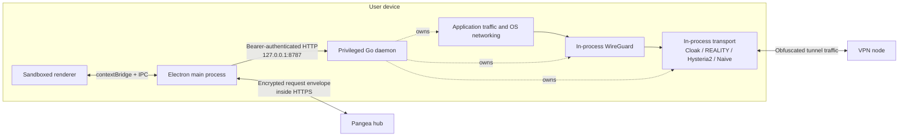
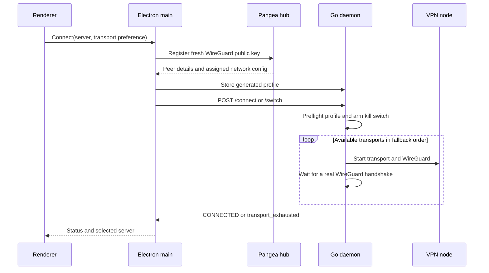
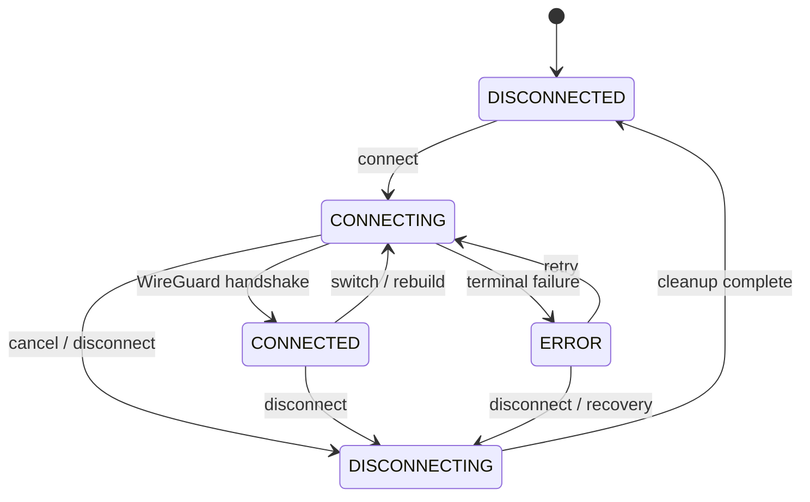

# Architecture

PangeaVPN is a desktop VPN client with a sandboxed Electron interface and a
privileged Go daemon. The Electron app owns user interaction and the remote
control plane; the daemon owns tunnel setup, transport selection, routing, DNS,
and leak prevention.

> [!NOTE]
> This document describes the client repository. The Pangea hub and VPN-node
> implementations live elsewhere, so server-side behavior is only described
> where the client contract makes it observable.

## At a glance

| Layer | Location | Responsibility |
| --- | --- | --- |
| Renderer | [`apps/desktop/src/renderer`](../apps/desktop/src/renderer) | UI, localization, user intent, and connection presentation |
| Preload bridge | [`apps/desktop/src/main/preload.ts`](../apps/desktop/src/main/preload.ts) | Narrow `contextBridge` API over asynchronous Electron IPC |
| Electron main | [`apps/desktop/src/main`](../apps/desktop/src/main) | Hub access, credentials, provisioning, daemon client, tray, updater, and recovery |
| Shared TypeScript contracts | [`packages/shared-types`](../packages/shared-types) | Zod schemas and inferred compile-time types used by the Electron application |
| Privileged daemon | [`daemon`](../daemon) | Local API, state machine, transports, WireGuard, routes, DNS, and kill switch |
| Remote services | Pangea infrastructure | Authentication, node discovery, peer provisioning, and VPN egress |

The TypeScript schemas are not shared with Go at compile time or enforced as
runtime validation by the daemon client. Go request structures live in
[`daemon/internal/api/server.go`](../daemon/internal/api/server.go), with profile
and status structures in
[`daemon/internal/state/types.go`](../daemon/internal/state/types.go). Keep both
sides aligned when changing the local API.

## System overview



There are two distinct paths:

- **Control plane:** renderer to Electron main to the local daemon or remote hub.
- **Data plane:** operating-system traffic to WireGuard to the selected
  censorship-resistant transport to the VPN node.

## Trust and privilege boundaries

### Renderer

The renderer runs with `sandbox: true`, `contextIsolation: true`, and
`nodeIntegration: false`. It cannot import Node.js APIs directly. Navigation,
new windows, webviews, and permission requests are restricted by the main
process, and the renderer is protected by a restrictive Content Security
Policy.

The preload script exposes only named operations such as status, connect,
disconnect, authentication, settings, and update actions. Calls cross into the
main process with `ipcRenderer.invoke()`.

Relevant code:

- [`main.ts`](../apps/desktop/src/main/main.ts)
- [`preload.ts`](../apps/desktop/src/main/preload.ts)
- [`ipc.ts`](../apps/desktop/src/shared/ipc.ts)
- [`index.html`](../apps/desktop/src/renderer/index.html)

### Electron main process

The main process is the unprivileged coordinator. It:

- stores and restores hub authentication;
- encrypts requests to the Pangea hub;
- provisions a fresh WireGuard peer for a selected server;
- writes generated profiles to the daemon;
- handles server fallback and connect cancellation;
- monitors daemon health and attempts platform-appropriate recovery;
- owns the tray, login-item, update, and network-change integrations.

It does not configure network interfaces or firewall rules itself.

### Go daemon

The daemon runs with the privileges needed to create a TUN interface and alter
system networking. It binds only to `127.0.0.1:8787` and requires a local Bearer
token on every endpoint except `/ping`.

The token prevents unauthenticated requests but should not be treated as a
strong boundary between users on the same machine: service installs make the
token readable by the desktop app. Profiles in `config.json` contain sensitive
WireGuard and transport credentials and are not application-level encrypted.

## Local daemon API

[`daemonClient.ts`](../apps/desktop/src/main/daemonClient.ts) is the Electron
client for the HTTP API registered in
[`daemon/internal/api/server.go`](../daemon/internal/api/server.go).

| Method | Route | Purpose |
| --- | --- | --- |
| `GET` | `/ping` | Unauthenticated liveness check |
| `GET` | `/status` | State, active transport, WireGuard counters, and kill-switch status |
| `POST` | `/connect` | Connect with a selected profile and transport preference |
| `POST` | `/disconnect` | Stop the tunnel, optionally retaining Lockdown |
| `POST` | `/switch` | Replace an active profile without dropping the kill switch first |
| `POST` | `/killswitch/engage` | Engage Lockdown while disconnected |
| `POST` | `/killswitch/permit` | Permit hub control-plane IPv4 addresses through Lockdown |
| `POST` | `/killswitch/clear` | Clear an inactive-session lock |
| `GET` | `/logs?since=<id>` | Read in-memory daemon log entries |
| `GET`, `POST` | `/config` | Read or replace stored profiles |

Body-bearing routes are limited to 1 MiB, requests are rate-limited, Bearer
tokens are compared in constant time, and handler errors are sanitized before
they cross the API boundary.

## Remote control plane

The main process uses
[`pangeaApiClient.ts`](../apps/desktop/src/main/pangeaApiClient.ts) for hub
requests. Current client operations include token login, bootstrap, regions,
subscription, device registration, device management, and peer registration.

### Secure request envelope

Hub payloads use an encrypted channel implemented in
[`secureChannel.ts`](../apps/desktop/src/main/secureChannel.ts):

1. Generate a fresh ephemeral X25519 client key pair.
2. Derive a shared secret against the pinned static hub public key.
3. Derive a 32-byte key with HKDF-SHA256.
4. Encrypt `{ method, route, headers, body }` with AES-256-GCM.
5. Send `{ eph, iv, ct, tag }` to `/v1/secure` over HTTPS.
6. Decrypt and authenticate the encrypted response with the same derived key.

The pinned key authenticates the encrypted application payload when the client
uses direct-IP/no-SNI routing on an intercepting network. Current defaults enable
direct-IP-only mode, so this is the normal route unless that setting is disabled;
outer TLS certificate verification is disabled for those direct-IP requests.
When direct-IP-only mode is disabled, normal domain requests use Electron
networking with certificate validation before direct-IP routes are considered.

> [!IMPORTANT]
> This is ephemeral-static ECDH, not full forward secrecy. A later compromise of
> the hub's static private key could expose previously recorded request
> envelopes. The pinned public key also requires a client update to rotate.

The remote route allowlist and server-side cryptographic handling are outside
this repository and must not be inferred from the client alone.

## Connection lifecycle

The Electron app and daemon deliberately split provisioning from tunnel setup.



### Provisioning and server fallback

For each server candidate, the main process:

1. generates a fresh WireGuard key pair;
2. registers the public key with the hub;
3. builds an `auto-<serverId>` daemon profile;
4. stores the profile through `/config`;
5. calls `/connect`, or `/switch` when replacing an active connection.

If every eligible transport fails in automatic mode, the main process may try
the next server in its finite fallback plan. Cancellation and terminal failures
restore the original daemon profile snapshot. See
[`connectAttempt.ts`](../apps/desktop/src/main/connectAttempt.ts) and
[`serverFallback.ts`](../apps/desktop/src/main/serverFallback.ts).

### Transport fallback

The daemon's automatic preference is:

1. Cloak
2. VLESS + REALITY
3. Hysteria2
4. NaiveProxy
5. Snowflake

Only transports configured in the selected profile are candidates. Cloak is
required by the current profile model. Snowflake is implemented but removed
from release candidates by `snowflakeReleaseGated`. NaiveProxy is available only
when the daemon was built with its native CGO engine; otherwise a stub reports
it as unavailable.

A remembered last-good transport for the current network can be promoted to the
front of the list. Every candidate must start successfully and complete a real
WireGuard handshake within the connection deadline. Failed candidates are torn
down before the next one starts.

The orchestration lives in
[`daemon/internal/api/service.go`](../daemon/internal/api/service.go).

## Data plane

```text
Application traffic
  -> OS routes
  -> WireGuard TUN (in-process)
  -> WireGuard UDP to a loopback transport listener
  -> selected transport (in-process)
  -> remote transport endpoint
  -> VPN node and internet egress
```

| Transport | Implementation | Release status |
| --- | --- | --- |
| Cloak | [`daemon/internal/cloak`](../daemon/internal/cloak) using the Pangea Cloak Go module | Enabled; baseline transport |
| VLESS + REALITY | [`daemon/internal/reality`](../daemon/internal/reality) using embedded sing-box/uTLS | Enabled when provisioned |
| Hysteria2 | [`daemon/internal/hysteria2`](../daemon/internal/hysteria2) using embedded sing-box/QUIC | Enabled when provisioned |
| NaiveProxy | [`daemon/internal/naive`](../daemon/internal/naive) with a CGO-linked native engine and in-process relay | Windows/macOS builds when native inputs resolve; release CI requires it |
| Snowflake | [`daemon/internal/snowflake`](../daemon/internal/snowflake) using the Tor Snowflake library | Implemented but release-gated |

No separate `wg`, `wg-quick`, `wireguard-go`, Cloak, or NaiveProxy tunnel
process is launched. "In-process" applies to tunnel engines, not every platform
operation: macOS and firewall backends still invoke standard operating-system
networking tools where required.

## WireGuard and platform networking

The daemon imports wireguard-go as a library on every supported platform. The
current tunnel is IPv4-only: IPv6 interface addresses, DNS servers, and
`AllowedIPs` are rejected, while the kill switch blocks non-loopback IPv6.

| Platform | Tunnel and network setup | Kill switch | Managed daemon model |
| --- | --- | --- | --- |
| Windows | In-process WireGuard TUN; `winipcfg` configures addresses, routes, DNS, and endpoint bypasses | Windows Filtering Platform (WFP) | `PangeaDaemon` automatic LocalSystem service |
| macOS | In-process utun; `ifconfig`, `route`, and `networksetup` apply address, route, and DNS changes | PF anchor through `pfctl` | Root `launchd` daemon when installed with `install-mac.sh` |
| Linux | In-process TUN; netlink plus routing table/fwmark `51820`; systemd-resolved D-Bus or `/etc/resolv.conf` for DNS | nftables with iptables/ip6tables fallback | Root systemd service when installed with `install-linux.sh` |

Platform code lives in:

- [`daemon/internal/wg`](../daemon/internal/wg)
- [`daemon/internal/platform`](../daemon/internal/platform)

Known transport endpoint addresses and hub control-plane addresses are routed
outside the tunnel to prevent recursion and preserve recovery traffic.

## Kill switch and Lockdown

The daemon engages the kill switch **before** starting a transport or WireGuard.
Initial rules permit only the traffic needed to establish the tunnel, including
loopback, configured transport endpoints, hub bypass addresses, DHCP, and
optional LAN ranges. After a successful handshake, the active tunnel interface
is permitted.

This ordering makes connection failure fail closed: if every transport fails,
the kill switch remains active until disconnect or explicit recovery clears it.

Lockdown mode intentionally retains the kill switch after disconnect and records
that intent in `killswitch-state.json`. On startup, the daemon distinguishes an
intentional lock from stale firewall state, attempts to adopt an existing
tunnel, and cleans up stale platform state when safe.

## State machine and health



The externally visible states are:

- `DISCONNECTED`
- `CONNECTING`
- `CONNECTED`
- `DISCONNECTING`
- `ERROR`

`CONNECTED` is set only after WireGuard reports a non-zero handshake. While
connected, a three-second health loop checks the active transport, WireGuard,
and kill switch. It can restart a stopped transport, mark the session errored
when critical components disappear, or rebuild a session after a stale
WireGuard handshake.

## Process models

| Mode | Daemon behavior |
| --- | --- |
| Windows development | `scripts/dev.mjs` builds the daemon and requests UAC elevation |
| Windows installed | NSIS installs and starts `PangeaDaemon`; the packaged app expects that service and does not launch a bundled fallback |
| macOS development | Development startup runs the daemon as root while preserving the user's support directory |
| macOS complete install | The DMG-bundled `install-mac.sh` installs a root `launchd` service; the raw `.pkg` only stages the daemon |
| Linux development | Development startup uses a root daemon because TUN and networking changes require privilege |
| Linux source install | `scripts/install-linux.sh` installs and enables `pangea-daemon.service` |
| Linux AppImage or `.deb` alone | The package contains a daemon but does not install a systemd unit; elevated recovery may use systemd or PolicyKit |

See [Binaries and Packaging](binaries-and-packaging.md) for exact installer
contents and artifact behavior.

## Runtime data

| Platform and mode | Daemon state directory |
| --- | --- |
| Windows service | `%ProgramData%\PangeaVPN\` |
| macOS managed service | `/Library/Application Support/PangeaVPN/` |
| macOS user/development | `~/Library/Application Support/pangeavpn-desktop/` |
| Linux systemd install | `/etc/pangeavpn/` |
| Linux user/development | `~/.config/pangeavpn-desktop/` or `PANGEA_APP_SUPPORT_DIR` |

Depending on mode, the directory contains:

| File | Purpose |
| --- | --- |
| `daemon-token.txt` | Local API Bearer token |
| `config.json` | VPN profiles, including WireGuard and transport credentials |
| `killswitch-state.json` | Persistent Lockdown intent |
| `transport-memory.json` | Last-good transport by network fingerprint |
| `settings.json` | Desktop settings plus cached recovery details such as the last server and hub IP |
| `logs/daemon.log` | Persistent daemon log |
| `logs/daemon-crash.log` | Crash diagnostics |

Hub session, license, and device identity values are stored by the Electron main
process, normally protected with Electron `safeStorage`; a restrictive
file-permission fallback is used when secure storage is unavailable. Auth data
remains per-user even when daemon state is machine-scoped. `settings.json`
follows the Electron app-support directory, which can be machine-scoped in
managed Windows and macOS installations.

## Source map

| Concern | Source of truth |
| --- | --- |
| Electron startup and IPC handlers | [`apps/desktop/src/main/main.ts`](../apps/desktop/src/main/main.ts) |
| Preload API | [`apps/desktop/src/main/preload.ts`](../apps/desktop/src/main/preload.ts) |
| Hub client and profile generation | [`apps/desktop/src/main/pangeaApiClient.ts`](../apps/desktop/src/main/pangeaApiClient.ts) |
| Secure envelope | [`apps/desktop/src/main/secureChannel.ts`](../apps/desktop/src/main/secureChannel.ts) |
| Daemon process recovery | [`apps/desktop/src/main/daemonProcess.ts`](../apps/desktop/src/main/daemonProcess.ts) |
| Runtime paths | [`platformPaths.ts`](../apps/desktop/src/main/platformPaths.ts), [`daemon/internal/platform/paths.go`](../daemon/internal/platform/paths.go) |
| Daemon HTTP routes | [`daemon/internal/api/server.go`](../daemon/internal/api/server.go) |
| Connection state machine | [`daemon/internal/api/service.go`](../daemon/internal/api/service.go) |
| State and profile structures | [`daemon/internal/state/types.go`](../daemon/internal/state/types.go) |
| WireGuard backends | [`daemon/internal/wg`](../daemon/internal/wg) |
| Kill-switch backends | [`daemon/internal/platform`](../daemon/internal/platform) |
| Build and installer model | [Binaries and Packaging](binaries-and-packaging.md) |
