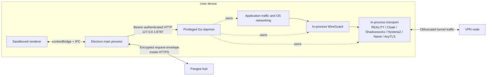
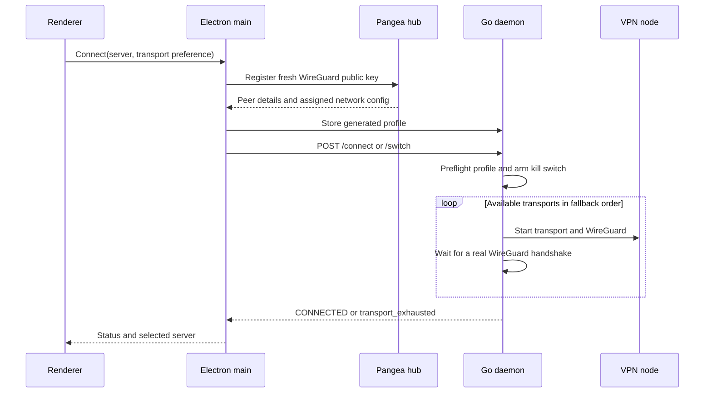
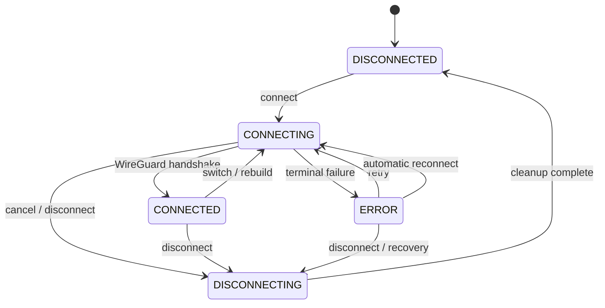

# Architecture

PangeaVPN is a desktop VPN client with a sandboxed Electron interface and a
privileged Go daemon. The Electron app handles the user and the remote control
plane. The daemon handles everything that touches the network: tunnel setup,
transport selection, routing, DNS and leak prevention.

> [!NOTE]
> This document covers the client repository. The Pangea hub and VPN nodes live
> elsewhere, so server-side behavior only appears here where the client contract
> makes it observable.

**On this page:** [At a glance](#at-a-glance) ·
[Trust boundaries](#trust-and-privilege-boundaries) ·
[Local API](#local-daemon-api) · [Control plane](#remote-control-plane) ·
[Connection lifecycle](#connection-lifecycle) · [Data plane](#data-plane) ·
[Kill switch](#kill-switch-and-lockdown) ·
[Split tunnelling](#split-tunnelling) · [Health](#state-machine-and-health) ·
[Process models](#process-models) · [Runtime data](#runtime-data) ·
[Source map](#source-map)

## At a glance

| Layer | Location | Responsibility |
| --- | --- | --- |
| Renderer | [`apps/desktop/src/renderer`](../apps/desktop/src/renderer) | UI, localization, user intent and connection presentation |
| Preload bridge | [`apps/desktop/src/main/preload.ts`](../apps/desktop/src/main/preload.ts) | A narrow `contextBridge` API over asynchronous Electron IPC |
| Electron main | [`apps/desktop/src/main`](../apps/desktop/src/main) | Hub access, credentials, provisioning, daemon client, tray, updater and recovery |
| Shared TypeScript contracts | [`packages/shared-types`](../packages/shared-types) | Zod schemas and inferred compile-time types for the Electron app |
| Privileged daemon | [`daemon`](../daemon) | Local API, state machine, transports, WireGuard, routes, DNS and kill switch |
| Remote services | Pangea infrastructure | Authentication, node discovery, peer provisioning and VPN egress |

The TypeScript schemas aren't shared with Go at compile time, and the daemon
client doesn't enforce them at runtime either. The Go request structures are in
[`daemon/internal/api/server.go`](../daemon/internal/api/server.go), and the
profile and status structures are in
[`daemon/internal/state/types.go`](../daemon/internal/state/types.go). If you
change the local API, update both sides.

## System overview


```mermaid
flowchart LR
    subgraph Device[User device]
        Renderer[Sandboxed renderer] <-->|contextBridge + IPC| Main[Electron main process]
        Main -->|Bearer-authenticated HTTP<br/>127.0.0.1:8787| Daemon[Privileged Go daemon]
        OS[Application traffic and OS networking] --> WG[In-process WireGuard]
        WG --> Transport[In-process transport<br/>REALITY / Cloak / Shadowsocks / Hysteria2 / Naive / AnyTLS]
        Daemon -. owns .-> OS
        Daemon -. owns .-> WG
        Daemon -. owns .-> Transport
    end

    Main <-->|Encrypted request envelope<br/>inside HTTPS| Hub[Pangea hub]
    Transport <-->|Obfuscated tunnel traffic| Node[VPN node]
```

There are two separate paths:

| Path | Route |
| --- | --- |
| Control plane | Renderer → Electron main → the local daemon or the remote hub |
| Data plane | OS traffic → WireGuard → the selected transport → the VPN node |

## Trust and privilege boundaries

### Renderer

The renderer runs with `sandbox: true`, `contextIsolation: true` and
`nodeIntegration: false`, so it can't import Node.js APIs. The main process
restricts navigation, new windows, webviews and permission requests, and a
restrictive Content Security Policy covers the page itself.

The preload script exposes only named operations (status, connect, disconnect,
authentication, settings, updates and so on). Each call crosses into the main
process through `ipcRenderer.invoke()`.

Relevant code: [`main.ts`](../apps/desktop/src/main/main.ts) ·
[`preload.ts`](../apps/desktop/src/main/preload.ts) ·
[`ipc.ts`](../apps/desktop/src/shared/ipc.ts) ·
[`index.html`](../apps/desktop/src/renderer/index.html)

### Electron main process

The main process is the unprivileged coordinator. It:

- stores and restores hub authentication;
- encrypts requests to the Pangea hub;
- provisions a fresh WireGuard peer for the selected server;
- writes the generated profiles to the daemon;
- handles server fallback and connect cancellation;
- watches daemon health and attempts recovery in whatever way suits the platform;
- owns the tray, login item, updater and network-change integrations.

It never configures network interfaces or firewall rules itself.

### Go daemon

The daemon runs with enough privilege to create a TUN interface and change
system networking. It binds only to `127.0.0.1:8787` and requires a local Bearer
token on every endpoint except `/ping`.

> [!WARNING]
> The token stops unauthenticated requests, but don't treat it as a strong
> boundary between users on the same machine: service installs make it readable
> by the desktop app. Profiles in `config.json` hold sensitive WireGuard and
> transport credentials and have no application-level encryption.

## Local daemon API

[`daemonClient.ts`](../apps/desktop/src/main/daemonClient.ts) is the Electron
client for the HTTP API registered in
[`daemon/internal/api/server.go`](../daemon/internal/api/server.go) and
[`post_quantum.go`](../daemon/internal/api/post_quantum.go).

| Method | Route | Purpose |
| --- | --- | --- |
| `GET` | `/ping` | Unauthenticated liveness check |
| `GET` | `/status` | State, active transport, WireGuard counters and kill switch status |
| `POST` | `/connect` | Connect with a selected profile and transport preference |
| `POST` | `/disconnect` | Stop the tunnel, optionally keeping Lockdown |
| `POST` | `/switch` | Replace the active profile without dropping the kill switch first |
| `POST` | `/killswitch/engage` | Engage Lockdown while disconnected |
| `POST` | `/killswitch/permit` | Let hub control-plane IPv4 addresses through Lockdown |
| `POST` | `/killswitch/clear` | Clear an inactive-session lock |
| `POST` | `/transport-memory/clear` | Forget the last-good transport remembered for each network |
| `POST` | `/realityproxy/start`, `/realityproxy/stop` | Run the local REALITY proxy that carries hub traffic |
| `POST` | `/ssproxy/start`, `/ssproxy/stop` | Run the local Shadowsocks proxy that carries hub traffic |
| `POST` | `/pq/offer`, `/pq/finish`, `/pq/encapsulate` | ML-KEM-768 key material for the peer's pre-shared key and the hub channel |
| `GET` | `/logs?since=<id>` | Read in-memory daemon log entries |
| `GET`, `POST` | `/config` | Read or replace stored profiles |
| `GET`, `POST` | `/split-tunnel` | Read or save the excluded apps and IPv4 ranges; answers without waiting on a running connect |

The two hub proxies are deliberately separate from `/connect`, because they have
to work before any profile exists.

Body-bearing routes are capped at 1 MiB and every route is rate-limited. Bearer
tokens are compared in constant time, and handler errors are sanitized before
they cross the API boundary.

## Remote control plane

The main process sends hub requests through
[`pangeaApiClient.ts`](../apps/desktop/src/main/pangeaApiClient.ts). Its
operations include token login, bootstrap, regions, subscription, device
registration, device management and peer registration.

### Secure request envelope

Hub payloads travel in an encrypted envelope built by
[`secureChannel.ts`](../apps/desktop/src/main/secureChannel.ts). Two versions
exist, and the client picks v2 whenever it can.

**v2 (`/v2/secure`)**, hybrid classical and post-quantum:

1. Generate a fresh ephemeral X25519 key pair and derive a shared secret against
   the pinned static hub key.
2. Ask the daemon (`/pq/encapsulate`) for an ML-KEM-768 encapsulation to the
   hub's second pinned key, `SERVER_KEM_PUBLIC_KEY_B64`.
3. Run both secrets through HKDF-SHA256 to get two 32-byte keys, one for each
   direction.
4. Encrypt `{ method, route, headers, body }` with AES-256-GCM, authenticating
   the ephemeral key and KEM ciphertext as associated data.
5. Send `{ eph, kem, iv, ct, tag }` to `/v2/secure` over HTTPS.
6. Open the response with the server-to-client key and the same associated
   data, which ties the reply to the request it answers.

**v1 (`/v1/secure`)** is the same exchange with X25519 alone and a single key
for both directions. The client falls back to it when the daemon can't
encapsulate. Only the local daemon decides that, so nothing on the network can
force the downgrade. See [Post-quantum protection](post-quantum.md).

The pinned keys authenticate the payload independently of whatever carries it.
That's what lets the client use paths where the outer TLS session proves
nothing: direct-IP requests with no SNI turn off certificate verification, and
the fronted and proxied paths run through a party that terminates TLS itself.
None of them can read or forge an envelope.

> [!IMPORTANT]
> Neither version has full forward secrecy, because the hub's keys are static.
> Someone who later gets the hub's private X25519 key could open recorded v1
> envelopes; opening v2 envelopes would also take the private ML-KEM key.
> Rotating either pinned key needs a client update.

The remote route allowlist and the server-side crypto live outside this
repository. Don't infer them from the client alone.

### Reaching the hub

`ensureHub` works through the enabled methods in order and keeps the first one
that completes an encrypted probe. The user can switch each method off in
settings, but at least one has to stay on.

| # | Method | Setting | Gets past | Under Lockdown |
|:-:|---|---|---|:-:|
| 1 | Cached hub IP, no SNI | `directIp` | DNS altogether, since there's no lookup | Yes |
| 2 | DoH-resolved IP, no SNI | `directIp` | DNS poisoning and SNI-based blocking | No |
| 3 | Daemon's REALITY proxy | `reality` | A blackholed hub IP, while passing for ordinary TLS | Yes |
| 4 | Daemon's Shadowsocks proxy | `shadowsocks` | A blackholed hub IP | Yes |
| 5 | Edge relay | `fronted` | Enumeration of our address space, which takes out 1 to 4 at once | No |
| 6 | Plain HTTPS to the domain | `normal` (off by default) | Nothing. It's the baseline | No |

Under Lockdown, the proxies work because the daemon permits the node before it
dials, and the cached IP works because it needs no lookup. The relay and plain
HTTPS both need DNS, which Lockdown blocks.

Methods 1 to 4 all end on address space we own, so a censor who enumerates our
IPs and null-routes them defeats every one of them together. The edge relay is
there for that case. It answers on CDN anycast space shared with a large part of
the web, where a block costs the censor real collateral. It comes after our own
paths because it lets a third party see when our traffic flows, though never
what it says. See [`infra/edge-relay`](../infra/edge-relay).

Plain HTTPS comes last because it's the only method that puts the hub's hostname
on the wire in cleartext.

If every enabled method fails, the client fetches the signed
[dead drop](deaddrop-bootstrap-design.md) once, re-seeds its caches from it and
runs the list again. If that fails too and plain HTTPS is switched off,
`ensureHub` throws instead of falling back to it.

The hub advertises edge relays and control-plane REALITY and Shadowsocks
credentials. The client caches them in `settings.json` and moves whichever last
worked to the front. The app also ships seed relays and seed proxy credentials,
used until the hub sends its own list, so a fresh install has a way to the hub
before it has ever reached it. Each seeded proxy listener only forwards to the
hub, so a seed can't be used as a general-purpose proxy.

### Connecting with no hub at all

Provisioning needs the hub. `provision()` registers a fresh WireGuard key at
`/api/register`, so a cached node list can't produce a working profile on its
own.

Two caches cover the gap. The node list is persisted, so a cold start behind a
block still has servers to show and a retry plan to build. And when provisioning
fails because the hub can't be reached, `provisionAndConnect` falls back to the
profile the daemon already holds. That profile's WireGuard key was registered on
an earlier run, which makes it the only way to reach a node while the hub is
down.

The fallback is skipped for auth and subscription failures. Those mean the hub
did answer, and the peer that profile names will already have been
deprovisioned. Switching has no equivalent fallback, because a switch that can't
reach the hub unwinds to the connection the user already had.

## Connection lifecycle

The Electron app and the daemon keep provisioning and tunnel setup apart on
purpose.


```mermaid
sequenceDiagram
    participant UI as Renderer
    participant Main as Electron main
    participant Hub as Pangea hub
    participant D as Go daemon
    participant Node as VPN node

    UI->>Main: Connect(server, transport preference)
    Main->>Hub: Register fresh WireGuard public key
    Hub-->>Main: Peer details and assigned network config
    Main->>D: Store generated profile
    Main->>D: POST /connect or /switch
    D->>D: Preflight profile and arm kill switch
    loop Available transports in fallback order
        D->>Node: Start transport and WireGuard
        D->>D: Wait for a real WireGuard handshake
    end
    D-->>Main: CONNECTED or transport_exhausted
    Main-->>UI: Status and selected server
```

### Provisioning and server fallback

For each server candidate, the main process:

1. generates a fresh WireGuard key pair and asks the daemon for a post-quantum
   offer (`/pq/offer`);
2. registers the public key and the offer with the hub;
3. turns the node's answer into the peer's `PresharedKey` (`/pq/finish`) and
   builds an `auto-<serverId>` daemon profile;
4. stores the profile through `/config`;
5. calls `/connect`, or `/switch` when it's replacing an active connection.

If every eligible transport fails in automatic mode, the main process can move
on to the next server in its finite fallback plan. Cancellation and terminal
failures restore the original daemon profile. See
[`connectAttempt.ts`](../apps/desktop/src/main/connectAttempt.ts) and
[`serverFallback.ts`](../apps/desktop/src/main/serverFallback.ts).

### Multihop

With multihop on, the registration names the exit as its region and adds an
`entryRegion`. Every transport terminates on the entry node, and plain
WireGuard dials the entry's public relay port. The client never dials the exit
directly, which keeps it out of the kill switch permits. The profile id becomes
`auto-<exit>-via-<entry>`, so a cached single-hop peer is never reused for a
hop.

The user can pick the entry by hand. Otherwise the client takes the lightest
entry-capable server outside the exit's region, breaking ties by hub order. See
[`multihop.ts`](../apps/desktop/src/shared/multihop.ts).

### Transport fallback

In automatic mode the daemon tries transports in this order:

1. VLESS + REALITY
2. Cloak
3. Shadowsocks
4. Hysteria2
5. NaiveProxy
6. AnyTLS
7. Snowflake

Only transports configured in the selected profile are candidates, and the
current profile model always includes Cloak. `snowflakeReleaseGated` removes
Snowflake from release builds, because its WebRTC peer address is only found at
runtime and the kill switch can't permit it in advance. NaiveProxy is only
available when the daemon was built with its native CGO engine; otherwise a
stub reports it unavailable.

Each candidate has to start and complete a real WireGuard handshake within the
connection deadline. A candidate that fails is torn down before the next one
starts.

The daemon remembers the last transport that worked on each network and can
move it to the front of the list. If that transport's data path later goes
silent, the daemon redials it first instead of sending it to the back. It's only
demoted if it dies again within 10 minutes (`transportFlapWindow`), which is how
the daemon tells a lossy stall apart from DPI killing it under load.

The user can also choose a single transport instead of automatic mode. That
turns fallback off entirely: the chosen transport is the only candidate, and a
profile with no configuration for it is refused rather than downgraded.

### Plain WireGuard

Selecting `wireguard` connects with no transport at all. The profile's
`wireguard.directEndpoint` (the node's own UDP listener, as the hub reported it)
replaces the loopback `Endpoint` in the config text. Nothing else about the
session changes: the kill switch, handshake gate, health checks and recovery all
work the same way.

It's the fastest method with the least overhead, and also the only one that is
recognizable on the wire as a VPN. So the automatic cascade never selects it,
and a direct session is never recorded as the network's last-good transport.

The orchestration is in
[`daemon/internal/api/service.go`](../daemon/internal/api/service.go).

## Data plane

```text
Application traffic
  -> OS routes
  -> WireGuard TUN (in-process)
  -> WireGuard UDP to a loopback transport listener
  -> selected transport (in-process)
  -> remote transport endpoint
  -> VPN node and internet egress
```

| Transport | Implementation | Release status |
| --- | --- | --- |
| VLESS + REALITY | [`daemon/internal/reality`](../daemon/internal/reality) using embedded sing-box/uTLS | Enabled when provisioned |
| Cloak | [`daemon/internal/cloak`](../daemon/internal/cloak) using the Pangea Cloak Go module | Enabled; baseline transport |
| Shadowsocks | [`daemon/internal/shadowsocks`](../daemon/internal/shadowsocks) using embedded sing-box (AEAD / SS-2022) | Enabled when provisioned |
| Hysteria2 | [`daemon/internal/hysteria2`](../daemon/internal/hysteria2) using embedded sing-box/QUIC | Enabled when provisioned |
| NaiveProxy | [`daemon/internal/naive`](../daemon/internal/naive) with a CGO-linked native engine and in-process relay | Windows and macOS builds when the native inputs resolve; release CI requires it |
| AnyTLS | [`daemon/internal/anytls`](../daemon/internal/anytls) using embedded sing-box (padded TLS session, WireGuard carried as UDP-over-TCP) | Enabled when provisioned |
| Snowflake | [`daemon/internal/snowflake`](../daemon/internal/snowflake) using the Tor Snowflake library | Implemented but release-gated |
| Plain WireGuard | None. The tunnel dials the node directly and skips the loopback listener | Enabled on explicit user selection only |

The daemon never launches a separate `wg`, `wg-quick`, `wireguard-go`, Cloak or
NaiveProxy process. "In-process" is about the tunnel engines, though, not every
platform operation: on macOS, and in the firewall backends, the daemon still
calls standard OS networking tools where it has to.

## WireGuard and platform networking

The daemon uses wireguard-go as a library on every supported platform. The
tunnel is IPv4-only for now: it rejects IPv6 interface addresses, DNS servers
and `AllowedIPs`, and the kill switch blocks non-loopback IPv6.

| Platform | Tunnel and network setup | Kill switch | Managed daemon model |
| --- | --- | --- | --- |
| Windows | In-process WireGuard TUN; `winipcfg` sets addresses, routes, DNS and endpoint bypasses | Windows Filtering Platform (WFP) | `PangeaDaemon`, an automatic LocalSystem service |
| macOS | In-process utun; `ifconfig`, `route` and `networksetup` apply address, route and DNS changes | PF anchor through `pfctl` | Root `launchd` daemon, when installed with `install-mac.sh` |
| Linux | In-process TUN; netlink plus routing table/fwmark `51820`; systemd-resolved over D-Bus or `/etc/resolv.conf` for DNS | nftables, falling back to iptables/ip6tables | Root systemd service, when installed with `install-linux.sh` |

Platform code lives in [`daemon/internal/wg`](../daemon/internal/wg) and
[`daemon/internal/platform`](../daemon/internal/platform).

Known transport endpoints and hub control-plane addresses are routed outside the
tunnel. That prevents routing loops and keeps recovery traffic flowing.

## Kill switch and Lockdown

The daemon engages the kill switch **before** it starts a transport or
WireGuard. The first rules permit only what's needed to bring the tunnel up:
loopback, the configured transport endpoints, hub bypass addresses, DHCP and,
optionally, LAN ranges. Once the handshake succeeds, the tunnel interface is
permitted too.

Because of that ordering, a failed connection fails closed. If every transport
fails, the kill switch stays on until a disconnect or an explicit recovery
clears it.

**Forwarded traffic.** The lock also covers traffic the host forwards for guests
(WSL2, Hyper-V NAT, Docker, libvirt), which never reaches the socket-level
rules. Windows blocks at the `IPFORWARD` layers and only permits forwarding onto
the tunnel interface; nftables and iptables carry a `forward` chain beside
`output`. Frames bridged between containers on the same bridge keep working.
VMs bridged straight onto the physical NIC sit below the host stack, and no
platform can cover them. Guests may reach [excluded ranges](#split-tunnelling)
too. On Linux the `forward` chain lets traffic from an excluded range through
only as the reply to a connection a guest opened (conntrack's reply direction).
A guest whose own subnet lies inside an excluded range therefore can't open
connections to anywhere else off-tunnel. It is still an excluded destination,
though, so connections other hosts open to it (a published or port-forwarded
service, say) are forwarded and its replies pass.

**At boot**, the lock has to be back before the network is. Windows installs
boot-time twins of the persistent filters to cover the window before the Base
Filtering Engine starts. Linux runs `pangea-killswitch-boot.service` before
`network-pre.target`. macOS enables pf from a LaunchDaemon whenever a kill
switch anchor is on disk.

**Allow LAN** opens the local ranges but not the resolvers on them. DNS and
DNS-over-TLS (ports 53 and 853) to a LAN address stay blocked on every platform,
because a router that forwards lookups upstream is a DNS leak. A resolver named
in the profile is routed into the tunnel, so it doesn't need a permit of its
own. On macOS the pf anchor also blocks unsolicited inbound traffic, letting in
only loopback, the DHCP reply and (under Allow LAN) the LAN. It flushes pf's
state table when the lock first lands, so connections opened earlier can't
outlive it.

**During a session**, the local permit endpoint only accepts addresses that a
stored profile already carries (the hub, and the transports the hub handed out).
Any other address is refused, since the hub is reachable through the tunnel at
that point.

**Lockdown mode** keeps the kill switch on after disconnect, deliberately, and
records that choice in `killswitch-state.json`. The retained lock permits only
the hub. The departing server's endpoints and the dead tunnel's interface permit
are both removed, since macOS reuses utun numbers and Windows can reuse an
interface index. On startup the daemon tells an intentional lock apart from
stale firewall state, tries to adopt an existing tunnel, and cleans up stale
platform state when it's safe to.

## Split tunnelling

Two kinds of traffic can skip the tunnel: excluded apps and excluded IPv4
ranges. The settings are machine-wide, kept by the daemon in
`split-tunnel.json`, and every account on the machine follows them. They travel
over `GET` and `POST /split-tunnel`. A save never waits on a connect: app rules
apply at once, and a background reconciler moves the ranges onto the live
session as soon as it can take the session lock.

**Excluded ranges** are carved out of the peer's `AllowedIPs`, the way Allow LAN
carves out local ranges, and the kill switch permits them. The tunnel address
and the session's resolvers stay routed through the tunnel, and ports 53 and 853
stay blocked off it. On a live session the reconciler first permits the old and
new ranges together, then moves the device's `AllowedIPs` and routes in place
(no reconnect, no new handshake), then drops the old permits. A failed move
keeps both sets permitted and retries; it never touches the connection state.
Ranges must be IPv4, `/8` or narrower, at most 64 of them, and cost at most 1024
tunnel routes. A server whose own `AllowedIPs` leave no room for them keeps them
all in the tunnel and says so in `/status`.

**Excluded apps** need no kernel driver. The daemon already reads every packet
bound for the tunnel, so [`daemon/internal/splittunnel`](../daemon/internal/splittunnel)
wraps wireguard-go's TUN device. The first packets of a new flow wait while the
classifier finds the socket that owns it (IP Helper tables on Windows,
`sock_diag` on Linux, the `pcblist` sysctls on macOS), then that process and the
ancestors it was seen starting under. If the owner or a recorded ancestor
matches an excluded app, the flow ends in userspace (TCP in a gVisor stack, UDP
in a small NAT) and the daemon re-sends it from its own socket, pinned to the
physical interface. Everything else, and anything the engine can't attribute
with certainty, goes into the tunnel unchanged. The daemon's own process tree
and the desktop app never bypass.

| Platform | Off-tunnel sockets | What the kill switch permits |
| --- | --- | --- |
| Windows | `IP_UNICAST_IF` on the physical interface | The daemon image (`ALE_APP_ID`), on any interface but the tunnel |
| macOS | Opened by a root broker (`--split-egress-broker`) running under the `_pangeasplit` group, with `IP_BOUND_IF` | Traffic of that group, which has no members |
| Linux | `SO_MARK 0x1ca6c`, which skips the tunnel's policy-routing rule | Packets carrying that mark |

On macOS, a socket pinned with `IP_BOUND_IF` has no route once the tunnel's
`0.0.0.0/1` is installed: XNU's last-resort lookup of the unscoped default
matches that `/1`, and configd never scopes the primary interface's own default.
So while apps are excluded and a tunnel is up (the egress permit's condition),
the daemon keeps a scoped copy of the primary default (`route add -ifscope <if>
-proto2 default <gw>`). It follows the gateway and the primary interface, and it
is removed when it stops being wanted, on shutdown, and after a crash at the next
start or by the uninstaller. On the primary interface the kernel prefers it to
configd's default even for unscoped lookups, which is why it must track configd;
it lags by at most one refresh. A copy left on an interface that lost primary
status is only removed on a later refresh, because configd may have just taken
that key over. `RTF_PROTO2` lets the daemon's routing-table readers tell it apart.

The split permits live only in the kill switch's memory. A restarted daemon
never re-arms them from disk; each bring-up applies them again from
`split-tunnel.json`, and the routes only ever follow what the lock actually
permits. A Lockdown disconnect drops the range permits before it narrows the
lock to the hub. The app egress permit is withdrawn once the last tunnel device
closes. The engine logs no per-flow data, and `/status` carries counts, never
paths or ranges.

Limits of this version:

- Lookups through the system resolver, and all traffic to ports 53 and 853, stay
  in the tunnel. Geo-DNS may therefore pick servers near the VPN exit, and a
  captive-portal login through an excluded browser fails while the tunnel is
  down.
- Excluded apps get no IPv6 and no relayed ICMP errors, and they only bypass
  while a tunnel device exists. With the kill switch armed and no device they're
  blocked like everything else.
- Connections an app opened before it was excluded stay in the tunnel. Removing
  an app resets its bypassed TCP connections, which reconnect through the VPN.
- Exclusion passes to child processes only if the daemon saw the parent alive.
  Launchers that exit at once don't pass it on; the app picker uses folder rules
  for those.
- Bypassed traffic is proxied: the app sees the tunnel address as its own, gets
  no unsolicited inbound traffic, and loses TOS/ECN marks.
- On Linux every server switch recreates the device, which resets excluded
  connections, and strict reverse-path filtering (`rp_filter=1`) drops bypass
  replies; the daemon reports it as `strictReversePath` and changes nothing.
- On macOS, Safari, WebKit views and system daemons may not be excludable. The
  macOS code is tested on synthetic data only.
- Exclusion isn't a security boundary. Anyone who can write to an excluded path,
  inject into an excluded process or spoof a parent process gets traffic off the
  tunnel.

## State machine and health


```mermaid
stateDiagram-v2
    [*] --> DISCONNECTED
    DISCONNECTED --> CONNECTING: connect
    ERROR --> CONNECTING: retry
    CONNECTING --> CONNECTED: WireGuard handshake
    CONNECTING --> ERROR: terminal failure
    CONNECTING --> DISCONNECTING: cancel / disconnect
    CONNECTED --> DISCONNECTING: disconnect
    CONNECTED --> CONNECTING: switch / rebuild
    DISCONNECTING --> DISCONNECTED: cleanup complete
    ERROR --> CONNECTING: automatic reconnect
    ERROR --> DISCONNECTING: disconnect / recovery
```

The daemon reports five states: `DISCONNECTED`, `CONNECTING`, `CONNECTED`,
`DISCONNECTING` and `ERROR`.

`CONNECTED` is only set once WireGuard reports a non-zero handshake. While
connected, a health loop checks the active transport, WireGuard and the kill
switch every three seconds. It can restart a stopped transport, mark the session
errored when a critical component disappears, or rebuild the session after a
stale handshake.

Two more checks catch sessions that look healthy but don't work.

### Host DNS

Windows hands an interface's resolvers to whoever wrote them last, and tells no
one. Another VPN client's DNS enforcement, or a Windows component re-profiling
the adapter, can take them over mid-session. Every name lookup on the machine
then fails while the tunnel itself is fine.

Setting DNS once at bring-up isn't enough, so every health tick reads the tunnel
interface's resolvers back and re-applies them if they've changed. Each
correction is logged and then held off for 30 seconds. That stops two writers
from trading writes every three seconds, and if they do fight, it leaves a
readable trail.

### Data path

A live handshake doesn't prove the tunnel works. Handshake packets are around
150 bytes and the node answers them itself, so a relay that has stopped
forwarding, or a path that no longer passes full-sized packets, leaves the
session rekeying every two minutes while nothing the user does gets through. A
browser reports that as a DNS probe error, on a connection the app still calls
connected.

So every 30 seconds the loop also resolves something over the tunnel, asking the
session's own resolvers for the root NS set. The query is raw UDP and bypasses
the OS resolver, so it tests the tunnel rather than host name resolution (the
check above covers that). Any well-formed reply counts, even an error RCODE: the
probe only asks whether the round trip happens, not whether the resolver liked
the question.

Three failed rounds in a row rebuild the session. A five-minute cooldown between
probe-driven rebuilds stops a node that answers handshakes but never carries
traffic from being rebuilt in a loop.

### Recovery

A failed rebuild doesn't end the session. The health loop keeps retrying from
`ERROR`, backing off from 2 seconds to 60, for as long as the profile is still
the user's. Only a disconnect clears it. The kill switch stays armed the whole
time, so giving up on the session would leave the device with no network at
all.

Two rules shape the retries:

- If the host has no off-tunnel address, the daemon waits instead of dialing. A
  resume that's still in progress isn't a failed attempt.
- If the session turns out to be still handshaking behind the armed kill switch,
  it goes back to `CONNECTED` instead of being rebuilt.

A health tick that lands more than 30 seconds late is treated as a resume from
sleep. Checks then pause for 15 seconds, so the tunnel isn't torn down and
redialed into a network that hasn't come back yet.

## Process models

| Mode | Daemon behavior |
| --- | --- |
| Windows development | `scripts/dev.mjs` builds the daemon and requests UAC elevation |
| Windows installed | NSIS installs and starts `PangeaDaemon`. The packaged app expects that service and has no bundled fallback |
| macOS development | The daemon runs as root and keeps the user's support directory |
| macOS complete install | The DMG's `install-mac.sh` installs a root `launchd` service. The raw `.pkg` only stages the daemon |
| Linux development | The daemon runs as root, since TUN and network changes need privilege |
| Linux source install | `scripts/install-linux.sh` installs and enables `pangea-daemon.service` and `pangea-killswitch-boot.service`, which re-applies a held kill switch before `network-pre.target` |
| Linux AppImage or `.deb` alone | The package contains a daemon but installs no systemd unit. Elevated recovery may use systemd or PolicyKit |

See [Binaries and packaging](binaries-and-packaging.md) for exactly what each
installer contains and does.

## Runtime data

| Platform and mode | Daemon state directory |
| --- | --- |
| Windows service | `%ProgramData%\PangeaVPN\` |
| macOS managed service | `/Library/Application Support/PangeaVPN/` |
| macOS user/development | `~/Library/Application Support/pangeavpn-desktop/` |
| Linux systemd install | `/etc/pangeavpn/` |
| Linux user/development | `~/.config/pangeavpn-desktop/` or `PANGEA_APP_SUPPORT_DIR` |

Depending on the mode, the directory holds:

| File | Purpose |
| --- | --- |
| `daemon-token.txt` | Local API Bearer token |
| `config.json` | VPN profiles, including WireGuard and transport credentials |
| `killswitch-state.json` | Persistent Lockdown intent |
| `transport-memory.json` | Last-good transport per network fingerprint |
| `split-tunnel.json` | Split-tunnel settings: excluded app paths and IPv4 ranges. The uninstaller removes it |
| `settings.json` | Desktop settings, plus what a blocked client falls back on: the last server and hub IP, the node list, edge relays, control-plane REALITY and Shadowsocks credentials, and the dead-drop sequence number |
| `logs/daemon.log` | Persistent daemon log |
| `logs/daemon-crash.log` | Crash diagnostics |

The Electron main process stores the hub session, license and device identity,
normally protected with Electron `safeStorage`. When secure storage isn't
available it falls back to restrictive file permissions. Auth data stays
per-user even when daemon state is machine-scoped. `settings.json` follows the
Electron app-support directory, which can be machine-scoped in managed Windows
and macOS installs.

## Source map

| Concern | Source of truth |
| --- | --- |
| Electron startup and IPC handlers | [`apps/desktop/src/main/main.ts`](../apps/desktop/src/main/main.ts) |
| Preload API | [`apps/desktop/src/main/preload.ts`](../apps/desktop/src/main/preload.ts) |
| Hub client and profile generation | [`apps/desktop/src/main/pangeaApiClient.ts`](../apps/desktop/src/main/pangeaApiClient.ts) |
| Hub methods and their order | [`apps/desktop/src/shared/hubMethods.ts`](../apps/desktop/src/shared/hubMethods.ts) |
| Secure envelope | [`apps/desktop/src/main/secureChannel.ts`](../apps/desktop/src/main/secureChannel.ts) |
| Dead drop | [`apps/desktop/src/main/deadDrop.ts`](../apps/desktop/src/main/deadDrop.ts), [Dead-drop bootstrap](deaddrop-bootstrap-design.md) |
| Multihop entry selection | [`apps/desktop/src/shared/multihop.ts`](../apps/desktop/src/shared/multihop.ts) |
| Daemon process recovery | [`apps/desktop/src/main/daemonProcess.ts`](../apps/desktop/src/main/daemonProcess.ts) |
| Runtime paths | [`platformPaths.ts`](../apps/desktop/src/main/platformPaths.ts), [`daemon/internal/platform/paths.go`](../daemon/internal/platform/paths.go) |
| Daemon HTTP routes | [`daemon/internal/api/server.go`](../daemon/internal/api/server.go) |
| Connection state machine | [`daemon/internal/api/service.go`](../daemon/internal/api/service.go) |
| State and profile structures | [`daemon/internal/state/types.go`](../daemon/internal/state/types.go) |
| WireGuard backends | [`daemon/internal/wg`](../daemon/internal/wg) |
| Post-quantum key exchange | [`daemon/internal/pq`](../daemon/internal/pq), [Post-quantum protection](post-quantum.md) |
| Kill switch backends | [`daemon/internal/platform`](../daemon/internal/platform) |
| Split tunnelling | [`daemon/internal/splittunnel`](../daemon/internal/splittunnel), [`daemon/internal/api/split_tunnel.go`](../daemon/internal/api/split_tunnel.go) |
| Build and installer model | [Binaries and packaging](binaries-and-packaging.md) |
