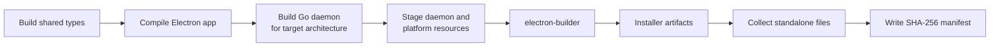

# Binaries and Packaging

PangeaVPN packages a TypeScript Electron application together with a native Go
daemon. Windows additionally ships architecture-matched WireGuard runtime DLLs;
macOS and Linux embed the daemon without separate tunnel executables.

> [!IMPORTANT]
> Each platform build is host-native. Run the Windows builder on Windows, the
> macOS builder on macOS, and the Linux builder on Linux.

## Build matrix

| Platform | Command | Architectures | Installers | Managed service |
| --- | --- | --- | --- | --- |
| Windows | `npm run build-bin:windows` | x64, arm64 | NSIS `.exe` | Installed automatically as `PangeaDaemon` |
| macOS | `npm run build-bin:mac` | x64, arm64 | `.pkg` plus installer `.dmg` | Installed by the DMG-bundled `install-mac.sh`, not by the raw `.pkg` alone |
| Linux | `npm run build-bin:linux` | x64, arm64 | AppImage and `.deb` | Not installed by either package; `install-linux.sh` creates the systemd service |

The packaging scripts compile both architectures by default, stage standalone
daemon artifacts, and write a SHA-256 manifest under `dist/bin/<platform>/`.

## Prerequisites

### Common

- Node.js 24 is the CI baseline.
- Go 1.25 or newer, as required by [`daemon/go.mod`](../daemon/go.mod).
- npm workspace dependencies installed from the repository root with `npm ci`.
- Network access for npm packages, Go modules, Electron downloads, and optional
  NaiveProxy native artifacts.
- The platform's standard compiler and packaging tools.

The platform scripts install the desktop workspace's development dependencies
and rebuild the shared types and desktop application before packaging, so a
separate `npm run build` is not required.

### Windows

- `goversioninfo` 1.7.0:

  ```powershell
  go install github.com/josephspurrier/goversioninfo/cmd/goversioninfo@v1.7.0
  ```

- Architecture-matched `wireguard.dll` and `wintun.dll` inputs.
- LLVM `clang-cl` and Visual Studio C++ tools for a NaiveProxy-enabled build.
- 7-Zip only when running the separate installer payload verifier.

### macOS

- Xcode Command Line Tools, including `clang`, `codesign`, and `iconutil`.
- `hdiutil` for the installer DMG.
- NaiveProxy native archives for each requested architecture when NaiveProxy is
  required.

### Linux

- The normal electron-builder Linux packaging toolchain.
- `dpkg`/`fakeroot` or equivalent tools for `.deb` creation.
- Runtime networking tools. The `.deb` currently declares `iproute2`,
  `wireguard-tools`, and `policykit-1`; kill-switch operation also expects
  nftables or the iptables fallback.

## Packaging pipeline



The key entry points are:

- [`scripts/build-daemon.mjs`](../scripts/build-daemon.mjs): builds one daemon for
  the requested `GOOS` and `GOARCH`.
- [`scripts/build-bin/windows.mjs`](../scripts/build-bin/windows.mjs): builds and
  packages Windows x64 and arm64 sequentially.
- [`scripts/build-bin/mac.mjs`](../scripts/build-bin/mac.mjs): builds and packages
  macOS arm64 and x64 sequentially, then creates installer DMGs.
- [`scripts/build-bin/linux.mjs`](../scripts/build-bin/linux.mjs): builds AppImage
  and `.deb` artifacts for x64 and arm64.
- [`apps/desktop/package.json`](../apps/desktop/package.json): defines
  electron-builder resources, targets, names, and installer options.

The platform artifact scripts currently pass
`--config.electronVersion=34.1.0` to electron-builder. This overrides the
Electron 41.5.0 dependency and package-level build setting for these artifact
commands. `npm run pack --workspace @pangeavpn/desktop` does not apply that
override.

## Daemon build

Production daemon builds always include the `with_utls` Go build tag because
VLESS + REALITY depends on sing-box's uTLS support.

NaiveProxy is compiled into the daemon only when its native archive, headers,
and compiler toolchain resolve. In that case the builder also adds the
`naive_cgo` tag. Otherwise the daemon contains a stub that reports NaiveProxy as
unavailable.

| Target | NaiveProxy behavior |
| --- | --- |
| Windows x64/arm64 | Native CGO engine when inputs and `clang-cl` resolve |
| macOS x64/arm64 | Native CGO engine when the matching archive resolves |
| Linux x64/arm64 | Stub; the current native resolver has no Linux implementation |
| Windows/macOS CI | `PANGEA_REQUIRE_NAIVE=1` makes missing native support a build failure |

The native inputs can come from a local NaiveProxy checkout or the pinned cache
under `.cache/pangea-naive/`. See
[`scripts/lib/naive-cgo.mjs`](../scripts/lib/naive-cgo.mjs) and
[`scripts/lib/naive-cgo-darwin.mjs`](../scripts/lib/naive-cgo-darwin.mjs).

## Runtime resources

In a packaged application, Electron resolves the bundled daemon relative to
`process.resourcesPath`:

```text
resources/daemon/PangeaDaemon.exe   # Windows
resources/daemon/daemon             # macOS and Linux
```

The implementation is in
[`apps/desktop/src/main/resourcePaths.ts`](../apps/desktop/src/main/resourcePaths.ts).

No separate `wg`, `wg-quick`, `wireguard-go`, Cloak, or NaiveProxy executable is
bundled. Those engines run in-process. Standard operating-system tools are still
used for service management, routes, DNS, and firewall integration.

### Windows binary inputs

The daemon builder requires both DLLs for the target Go architecture:

```text
apps/desktop/build/amd64/wireguard.dll
apps/desktop/build/amd64/wintun.dll
apps/desktop/build/arm64/wireguard.dll
apps/desktop/build/arm64/wintun.dll
```

The lower-level daemon builder also understands `x86` and `arm` source folders,
but the installer pipeline currently emits only x64 and arm64.

During each architecture build, the matching files are copied to:

```text
daemon/bin/PangeaDaemon.exe
daemon/bin/wireguard.dll
daemon/bin/wintun.dll
```

electron-builder then places that staged set under `resources/daemon/`. The
repository also carries `apps/desktop/resources/bin/win/wintun.dll`, which is
packaged under `resources/bin/win/`; it is separate from the architecture-matched
side-by-side DLL set used by the daemon.

## Windows package

### Build

```powershell
npm run build-bin:windows
```

Build only x64:

```powershell
npm run build-bin:windows:x64
```

Build or verify one architecture directly:

```powershell
node scripts/build-bin/windows.mjs --arch arm64
node scripts/verify-windows-installer.mjs
```

The verifier extracts each NSIS package and checks that critical resources were
not silently dropped by its embedded 7-Zip codec.

### Outputs

```text
dist/bin/windows/
|-- installer/
|   |-- x64/PangeaVPN-Setup-<version>-x64.exe
|   `-- arm64/PangeaVPN-Setup-<version>-arm64.exe
|-- daemon/
|   |-- PangeaDaemon-x64.exe
|   |-- PangeaDaemon-arm64.exe
|   |-- wireguard-x64.dll
|   |-- wireguard-arm64.dll
|   |-- wintun-x64.dll
|   `-- wintun-arm64.dll
`-- manifest.json
```

### Installer behavior

The assisted, per-machine NSIS installer:

1. installs the Electron application;
2. stages the daemon and DLLs in `%ProgramData%\PangeaVPN\`;
3. creates the automatic LocalSystem service `PangeaDaemon`;
4. configures restart-on-failure behavior;
5. grants built-in users permission to query and start the service;
6. starts the service;
7. optionally creates a common desktop shortcut.

The packaged app expects this installed service. A portable target name exists
in electron-builder configuration, but the current Windows target is NSIS only
and there is no packaged portable-daemon fallback.

Uninstall removes the service binaries and shortcuts but intentionally leaves
runtime state such as configuration, token, and logs in the support directory.
The custom service hooks live in
[`apps/desktop/build/installer.nsh`](../apps/desktop/build/installer.nsh).

### Icons and artwork

| Asset | Use |
| --- | --- |
| `apps/desktop/built/pangeavpn.ico` | App executable, installer, uninstaller, and installer header icon |
| `apps/desktop/build/PangeaVPN_connected.ico` | Connected-state runtime icon |
| `apps/desktop/build/installerHeader.bmp` | NSIS header artwork |
| `apps/desktop/build/installerSidebar.bmp` | NSIS install and uninstall sidebar |

The built primary icon is copied into app resources as
`build/PangeaVPN.ico` for runtime use.

## macOS package

### Build

```bash
npm run build-bin:mac
```

Build only Apple Silicon:

```bash
npm run build-bin:mac:arm64
```

Build Intel directly:

```bash
node scripts/build-bin/mac.mjs --arch x64
```

### Outputs

```text
dist/bin/mac/
|-- installer/
|   |-- arm64/
|   |   |-- <installer>.pkg
|   |   `-- <installer>-installer.dmg
|   `-- x64/
|       |-- <installer>-x64.pkg
|       `-- <installer>-x64-installer.dmg
|-- daemon/
|   |-- daemon-arm64
|   `-- daemon-x64
|-- bin/mac/
`-- manifest.json
```

`bin/mac/` receives any standalone files from
`apps/desktop/resources/bin/mac/`; it is currently empty apart from repository
placeholders.

### PKG versus installer DMG

These artifacts have different behavior:

| Artifact | What it does |
| --- | --- |
| Raw `.pkg` | Installs `PangeaVPN.app`, copies the daemon to `/Library/Application Support/PangeaVPN/PangeaDaemon`, clears quarantine, and ad-hoc signs the copied daemon |
| Installer `.dmg` | Contains the matching `.pkg` and `install-mac.sh`; the script performs the complete privileged service setup |

The raw package deliberately does **not** create a daemon token, install a
LaunchDaemon plist, or start the daemon. The complete script:

1. installs the `.pkg`;
2. creates the machine-scoped support directory and token;
3. installs `/Library/LaunchDaemons/com.pangea.pangeavpn.daemon.plist`, and `com.pangea.pangeavpn.pf.plist`, which enables pf at boot while a kill-switch anchor is on disk;
4. configures `RunAtLoad` and `KeepAlive`;
5. bootstraps and starts the service;
6. verifies `http://127.0.0.1:8787/ping`.

See [`scripts/install-mac.sh`](../scripts/install-mac.sh) and the raw package's
[`postinstall`](../apps/desktop/build/pkg-scripts/postinstall).

## Linux package

### Build

```bash
npm run build-bin:linux
```

The Linux script always builds both x64 and arm64. Unlike the Windows and macOS
scripts, it does not currently implement `--arch` or `PANGEA_BUILD_ARCHES`.

### Outputs

```text
dist/bin/linux/
|-- appimage/
|   |-- x64/<installer>.AppImage
|   `-- arm64/<installer>.AppImage
|-- deb/
|   |-- x64/PangeaVPN_<version>_<arch>.deb
|   `-- arm64/PangeaVPN_<version>_arm64.deb
|-- daemon/
|   |-- daemon-x64
|   `-- daemon-arm64
`-- manifest.json
```

### Service installation

The generated AppImage and `.deb` include `resources/daemon/daemon` but do not
create a systemd unit. For a complete source-based installation, use:

```bash
./scripts/install-linux.sh
```

That script installs the AppImage under `/opt/PangeaVPN/`, stages the daemon at
`/usr/local/bin/pangea-daemon`, creates `/etc/pangeavpn/`, and enables
`pangea-daemon.service` together with `pangea-killswitch-boot.service`, a oneshot
that re-applies a held kill switch before `network-pre.target`.

Without a managed service, the desktop package can find or launch its bundled
daemon, but actual tunnel creation still requires root. Recovery may use systemd
or PolicyKit where available.

## Architecture selection and environment

Windows and macOS accept a command-line or environment filter:

```bash
node scripts/build-bin/windows.mjs --arch x64
node scripts/build-bin/mac.mjs --arch arm64
```

```text
PANGEA_BUILD_ARCHES=x64
PANGEA_BUILD_ARCHES=x64,arm64
```

| Variable | Purpose |
| --- | --- |
| `PANGEA_REQUIRE_NAIVE=1` | Fail if the native NaiveProxy engine cannot be linked |
| `PANGEA_NAIVEPROXY_SRC` | Override the local NaiveProxy source directory |
| `PANGEA_CLANG_CL` | Override the Windows `clang-cl.exe` path |
| `PANGEA_BUILD_ARCHES` | Select Windows/macOS output architectures |
| `PANGEA_APP_SUPPORT_DIR` | Override the daemon's runtime state directory |
| `CSC_IDENTITY_AUTO_DISCOVERY=false` | Disable macOS signing identity discovery, as release CI currently does |

`GOOS`, `GOARCH`, CGO variables, and the NaiveProxy compiler wrapper variables
are normally set internally by the build scripts.

## Aggregate command

```bash
npm run build-bin
```

This runs the Windows, macOS, and Linux builders in sequence, records each result
in `dist/bin/manifest-all.json`, and exits non-zero if any target fails. Because
each child builder enforces its native host, this command is primarily an
orchestration/summary entry point and cannot complete all three targets on a
normal single-OS machine.

## Manifests and integrity

Each platform manifest records:

- generation time and selected architectures;
- artifact type and filename;
- source and output path;
- size in bytes;
- SHA-256 digest;
- Go architecture for daemon artifacts.

The project does not currently apply a Windows code-signing certificate or a
macOS Developer ID/notarization workflow. macOS installation ad-hoc signs the
copied daemon. Release CI publishes `SHA256SUMS.txt` beside the user-facing
installers so downloads can be checked independently.

## CI and releases

[`build-desktop.yml`](../.github/workflows/build-desktop.yml) currently:

1. runs desktop tests, `go vet`, and Go tests on Ubuntu, Windows, and macOS;
2. builds and verifies Windows x64/arm64 NSIS installers;
3. builds macOS x64/arm64 installer DMGs;
4. requires NaiveProxy native support for Windows and macOS artifacts;
5. publishes Windows `.exe` files, macOS installer `.dmg` files, and
   `SHA256SUMS.txt` for tagged releases.

Linux packaging is supported locally but is not currently built or published by
the release workflow. Standalone daemons and per-platform JSON manifests are
also local build outputs rather than GitHub release assets.

## Source map

| Concern | Source of truth |
| --- | --- |
| Root build commands | [`package.json`](../package.json) |
| electron-builder configuration | [`apps/desktop/package.json`](../apps/desktop/package.json) |
| Host daemon build | [`scripts/build-daemon.mjs`](../scripts/build-daemon.mjs) |
| Windows artifacts | [`scripts/build-bin/windows.mjs`](../scripts/build-bin/windows.mjs) |
| macOS artifacts | [`scripts/build-bin/mac.mjs`](../scripts/build-bin/mac.mjs) |
| Linux artifacts | [`scripts/build-bin/linux.mjs`](../scripts/build-bin/linux.mjs) |
| Aggregate manifest | [`scripts/build-bin/all.mjs`](../scripts/build-bin/all.mjs) |
| NaiveProxy native resolution | [`scripts/lib/naive-cgo.mjs`](../scripts/lib/naive-cgo.mjs) |
| Windows service installer | [`apps/desktop/build/installer.nsh`](../apps/desktop/build/installer.nsh) |
| macOS complete installer | [`scripts/install-mac.sh`](../scripts/install-mac.sh) |
| Linux complete installer | [`scripts/install-linux.sh`](../scripts/install-linux.sh) |
| CI and release assets | [`.github/workflows/build-desktop.yml`](../.github/workflows/build-desktop.yml) |
| Runtime design | [Architecture](architecture.md) |
