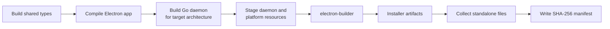

# Binaries and packaging

PangeaVPN ships a TypeScript Electron app together with a native Go daemon. On
Windows the installer also carries WireGuard runtime DLLs for the matching
architecture. macOS and Linux embed the daemon with no separate tunnel
executables.

> [!IMPORTANT]
> Every platform build is host-native. Build Windows on Windows, macOS on macOS
> and Linux on Linux.

**On this page:** [Build matrix](#build-matrix) ·
[Prerequisites](#prerequisites) · [Pipeline](#packaging-pipeline) ·
[Daemon build](#daemon-build) · [Windows](#windows-package) ·
[macOS](#macos-package) · [Linux](#linux-package) ·
[Environment](#architecture-selection-and-environment) ·
[Integrity](#manifests-and-integrity) · [CI](#ci-and-releases) ·
[Source map](#source-map)

## Build matrix

| Platform | Command | Architectures | Installers | Managed service |
| --- | --- | --- | --- | --- |
| Windows | `npm run build-bin:windows` | x64, arm64 | NSIS `.exe` | Installed automatically as `PangeaDaemon` |
| macOS | `npm run build-bin:mac` | x64, arm64 | `.pkg` plus installer `.dmg` | Installed by the DMG's `install-mac.sh`, not by the raw `.pkg` |
| Linux | `npm run build-bin:linux` | x64, arm64 | AppImage and `.deb` | Neither package installs it; `install-linux.sh` creates the systemd service |

By default the packaging scripts build both architectures, stage standalone
daemon artifacts, and write a SHA-256 manifest to `dist/bin/<platform>/`.

## Prerequisites

### All platforms

- Node.js 24, the version CI uses.
- Go 1.25 or newer, as [`daemon/go.mod`](../daemon/go.mod) requires.
- The npm workspace dependencies, installed from the repository root with
  `npm ci`.
- Network access for npm packages, Go modules, Electron downloads and, if you
  want NaiveProxy, its native artifacts.
- The platform's standard compiler and packaging tools.

You don't need a separate `npm run build` first. The platform scripts install
the desktop workspace's dev dependencies and rebuild the shared types and the
desktop app before they package anything.

### Windows

- `goversioninfo` 1.7.0:

  ```powershell
  go install github.com/josephspurrier/goversioninfo/cmd/goversioninfo@v1.7.0
  ```

- `wireguard.dll` and `wintun.dll` for each target architecture.
- LLVM `clang-cl` and the Visual Studio C++ tools, for a build with NaiveProxy.
- 7-Zip, but only if you run the separate installer payload verifier.

### macOS

- Xcode Command Line Tools, including `clang`, `codesign` and `iconutil`.
- `hdiutil` for the installer DMG.
- The NaiveProxy native archive for each architecture you build, if you need
  NaiveProxy.

### Linux

- The usual electron-builder Linux toolchain.
- `dpkg`/`fakeroot` or equivalent tools to build the `.deb`.
- Runtime networking tools. The `.deb` declares `iproute2`, `wireguard-tools`
  and `policykit-1`, and the kill switch also expects nftables or the iptables
  fallback.

## Packaging pipeline


```mermaid
flowchart LR
    Types[Build shared types] --> Desktop[Compile Electron app]
    Desktop --> Daemon[Build Go daemon<br/>for target architecture]
    Daemon --> Stage[Stage daemon and<br/>platform resources]
    Stage --> Builder[electron-builder]
    Builder --> Installers[Installer artifacts]
    Installers --> Collect[Collect standalone files]
    Collect --> Manifest[Write SHA-256 manifest]
```

| Entry point | What it does |
| --- | --- |
| [`scripts/build-daemon.mjs`](../scripts/build-daemon.mjs) | Builds one daemon for the requested `GOOS` and `GOARCH` |
| [`scripts/build-bin/windows.mjs`](../scripts/build-bin/windows.mjs) | Builds and packages Windows x64 and arm64, one after the other |
| [`scripts/build-bin/mac.mjs`](../scripts/build-bin/mac.mjs) | Builds and packages macOS arm64 and x64 one after the other, then creates the installer DMGs |
| [`scripts/build-bin/linux.mjs`](../scripts/build-bin/linux.mjs) | Builds the AppImage and `.deb` for x64 and arm64 |
| [`apps/desktop/package.json`](../apps/desktop/package.json) | electron-builder resources, targets, names and installer options |

electron-builder bundles the Electron runtime named by `electronVersion`, not
the installed `electron` package. The platform scripts and `install-linux.sh`
read that version from the installed package. The package's own build config
still has to name it, and `verify-pack-resources.mjs` fails the build when it
drifts, so bump `build.electronVersion` along with the `electron` dependency.

## Daemon build

Production daemon builds always include the `with_utls` Go build tag, because
VLESS + REALITY relies on sing-box's uTLS support.

NaiveProxy only gets compiled in when its native archive, headers and compiler
toolchain all resolve, and in that case the builder adds the `naive_cgo` tag
too. Otherwise the daemon contains a stub that reports NaiveProxy as
unavailable.

| Target | NaiveProxy |
| --- | --- |
| Windows x64/arm64 | Native CGO engine, when the inputs and `clang-cl` resolve |
| macOS x64/arm64 | Native CGO engine, when the matching archive resolves |
| Linux x64/arm64 | Stub. The native resolver has no Linux implementation yet |
| Android arm64-v8a | Native CGO engine, linked into the gomobile AAR (+16.6 MB) |
| Android arm/x86/x86_64 | Unlinked; the cascade ends at Hysteria2 |
| Windows/macOS CI | `PANGEA_REQUIRE_NAIVE=1` turns missing native support into a build failure |

The native inputs come from either a local NaiveProxy checkout or the pinned
cache under `.cache/pangea-naive/`. See
[`scripts/lib/naive-cgo.mjs`](../scripts/lib/naive-cgo.mjs) and
[`scripts/lib/naive-cgo-darwin.mjs`](../scripts/lib/naive-cgo-darwin.mjs).

Android takes the pinned prebuilt only. `scripts/fetch-naive-android.mjs` stages
`libpangea_naive.a` under `daemon/internal/naive/android/arm64-v8a/`, where the
cgo directives in `cgo_android.go` expect it, and `gomobile bind` then gets
`-tags naive_cgo`. Every socket Chromium opens is routed back through
`VpnService.protect()` by the fork's `PangeaNaiveSetSocketProtector` hook;
without it naive would dial its server through the TUN it is establishing.

## Runtime resources

In a packaged app, Electron finds the bundled daemon relative to
`process.resourcesPath`:

```text
resources/daemon/PangeaDaemon.exe   # Windows
resources/daemon/daemon             # macOS and Linux
```

The lookup is in
[`apps/desktop/src/main/resourcePaths.ts`](../apps/desktop/src/main/resourcePaths.ts).

There's no separate `wg`, `wg-quick`, `wireguard-go`, Cloak or NaiveProxy
executable in the bundle, since those engines all run in-process. The daemon
still uses standard OS tools for service management, routes, DNS and the
firewall.

### Windows binary inputs

The daemon builder needs both DLLs for the target Go architecture:

```text
apps/desktop/build/amd64/wireguard.dll
apps/desktop/build/amd64/wintun.dll
apps/desktop/build/arm64/wireguard.dll
apps/desktop/build/arm64/wintun.dll
```

The lower-level daemon builder also understands `x86` and `arm` source folders,
but the installer pipeline only produces x64 and arm64.

For each architecture, the build copies the matching files to:

```text
daemon/bin/PangeaDaemon.exe
daemon/bin/wireguard.dll
daemon/bin/wintun.dll
```

electron-builder then puts that staged set under `resources/daemon/`.

> [!NOTE]
> The repository also carries `apps/desktop/resources/bin/win/wintun.dll`, which
> is packaged under `resources/bin/win/`. It's separate from the
> architecture-matched DLL set the daemon loads side by side.

## Windows package

### Build

```powershell
npm run build-bin:windows          # x64 and arm64
npm run build-bin:windows:x64      # x64 only
```

To build one architecture directly, or to verify the installers:

```powershell
node scripts/build-bin/windows.mjs --arch arm64
node scripts/verify-windows-installer.mjs
```

The verifier unpacks each NSIS installer and checks that its embedded 7-Zip
codec didn't silently drop any critical resources.

### Outputs

```text
dist/bin/windows/
|-- installer/
|   |-- x64/PangeaVPN-Setup-<version>-x64.exe
|   `-- arm64/PangeaVPN-Setup-<version>-arm64.exe
|-- daemon/
|   |-- PangeaDaemon-x64.exe
|   |-- PangeaDaemon-arm64.exe
|   |-- wireguard-x64.dll
|   |-- wireguard-arm64.dll
|   |-- wintun-x64.dll
|   `-- wintun-arm64.dll
`-- manifest.json
```

### Installer behavior

The assisted, per-machine NSIS installer:

1. installs the Electron app;
2. stages the daemon and DLLs in `%ProgramData%\PangeaVPN\`;
3. creates `PangeaDaemon` as an automatic LocalSystem service;
4. sets it to restart on failure;
5. lets built-in users query and start the service;
6. starts the service;
7. optionally adds a desktop shortcut for all users.

The packaged app expects that service to exist. electron-builder's config does
name a portable target, but the Windows target is NSIS only, and there's no
packaged fallback that runs the daemon portably.

Uninstalling removes the service binaries and shortcuts. It deliberately leaves
runtime state (configuration, token and logs) in the support directory. The
custom service hooks are in
[`apps/desktop/build/installer.nsh`](../apps/desktop/build/installer.nsh).

### Icons and artwork

| Asset | Used for |
| --- | --- |
| `apps/desktop/built/pangeavpn.ico` | The app executable, installer, uninstaller and installer header icon |
| `apps/desktop/build/PangeaVPN_connected.ico` | The runtime icon while connected |
| `apps/desktop/build/installerHeader.bmp` | NSIS header artwork |
| `apps/desktop/build/installerSidebar.bmp` | NSIS install and uninstall sidebar |

The built primary icon is copied into the app resources as
`build/PangeaVPN.ico` for runtime use.

## macOS package

### Build

```bash
npm run build-bin:mac                     # arm64 and x64
npm run build-bin:mac:arm64               # Apple Silicon only
node scripts/build-bin/mac.mjs --arch x64 # Intel only
```

### Outputs

```text
dist/bin/mac/
|-- installer/
|   |-- arm64/
|   |   |-- <installer>.pkg
|   |   `-- <installer>-installer.dmg
|   `-- x64/
|       |-- <installer>-x64.pkg
|       `-- <installer>-x64-installer.dmg
|-- daemon/
|   |-- daemon-arm64
|   `-- daemon-x64
|-- bin/mac/
`-- manifest.json
```

`bin/mac/` collects any standalone files from `apps/desktop/resources/bin/mac/`.
For now that folder only holds repository placeholders.

### PKG versus installer DMG

The two artifacts do different things:

| Artifact | What it does |
| --- | --- |
| Raw `.pkg` | Installs `PangeaVPN.app`, copies the daemon to `/Library/Application Support/PangeaVPN/PangeaDaemon`, clears quarantine and ad-hoc signs the copied daemon |
| Installer `.dmg` | Contains the matching `.pkg` and `install-mac.sh`. The script does the full privileged service setup |

> [!WARNING]
> The raw `.pkg` deliberately does **not** create a daemon token, install a
> LaunchDaemon plist or start the daemon. Starting it without a token would
> crash-loop under `KeepAlive`.

The full install script:

1. installs the `.pkg`;
2. creates the machine-scoped support directory and token;
3. installs `/Library/LaunchDaemons/com.pangea.pangeavpn.daemon.plist`, plus
   `com.pangea.pangeavpn.pf.plist`, which enables pf at boot whenever a kill
   switch anchor is on disk;
4. sets `RunAtLoad` and `KeepAlive`;
5. bootstraps and starts the service;
6. checks `http://127.0.0.1:8787/ping`.

See [`scripts/install-mac.sh`](../scripts/install-mac.sh) and the raw package's
[`postinstall`](../apps/desktop/build/pkg-scripts/postinstall).

## Linux package

### Build

```bash
npm run build-bin:linux
```

The Linux script always builds both x64 and arm64. Unlike the Windows and macOS
scripts, it doesn't support `--arch` or `PANGEA_BUILD_ARCHES` yet.

### Outputs

```text
dist/bin/linux/
|-- appimage/
|   |-- x64/<installer>.AppImage
|   `-- arm64/<installer>.AppImage
|-- deb/
|   |-- x64/PangeaVPN_<version>_<arch>.deb
|   `-- arm64/PangeaVPN_<version>_arm64.deb
|-- daemon/
|   |-- daemon-x64
|   `-- daemon-arm64
`-- manifest.json
```

### Service installation

The AppImage and `.deb` both include `resources/daemon/daemon`, but neither one
creates a systemd unit. For a complete install from source, run:

```bash
./scripts/install-linux.sh
```

That script installs the AppImage under `/opt/PangeaVPN/`, stages the daemon at
`/usr/local/bin/pangea-daemon` and creates `/etc/pangeavpn/`. It then enables
`pangea-daemon.service` along with `pangea-killswitch-boot.service`, a oneshot
that re-applies a held kill switch before `network-pre.target`.

Without a managed service, the desktop app can still find or launch its bundled
daemon, but creating a tunnel still needs root. Recovery may use systemd or
PolicyKit where they're available.

## Architecture selection and environment

Windows and macOS take an architecture filter on the command line or through the
environment:

```bash
node scripts/build-bin/windows.mjs --arch x64
node scripts/build-bin/mac.mjs --arch arm64
```

```text
PANGEA_BUILD_ARCHES=x64
PANGEA_BUILD_ARCHES=x64,arm64
```

| Variable | Purpose |
| --- | --- |
| `PANGEA_REQUIRE_NAIVE=1` | Fail if the native NaiveProxy engine can't be linked |
| `PANGEA_NAIVEPROXY_SRC` | Use a different local NaiveProxy source directory |
| `PANGEA_CLANG_CL` | Use a different path to `clang-cl.exe` on Windows |
| `PANGEA_BUILD_ARCHES` | Choose the Windows/macOS output architectures |
| `PANGEA_APP_SUPPORT_DIR` | Move the daemon's runtime state directory |
| `CSC_IDENTITY_AUTO_DISCOVERY=false` | Turn off macOS signing identity discovery, as release CI does |

The build scripts normally set `GOOS`, `GOARCH`, the CGO variables and the
NaiveProxy compiler wrapper variables themselves.

## Aggregate command

```bash
npm run build-bin
```

This runs the Windows, macOS and Linux builders in turn, records each result in
`dist/bin/manifest-all.json`, and exits non-zero if any of them fails. Each
builder insists on its own host OS, though, so on a normal single-OS machine
this is really a summary entry point. It can't finish all three targets.

## Manifests and integrity

Each platform manifest records:

- when it was generated and which architectures were selected;
- each artifact's type and filename;
- its source and output path;
- its size in bytes;
- its SHA-256 digest;
- the Go architecture, for daemon artifacts.

> [!NOTE]
> Nothing is code-signed yet. There's no Windows code-signing certificate and no
> macOS Developer ID or notarization workflow; the macOS install only ad-hoc
> signs the copied daemon. Release CI publishes `SHA256SUMS.txt` next to the
> installers so anyone can check a download independently.

## CI and releases

[`build-desktop.yml`](../.github/workflows/build-desktop.yml):

1. runs the desktop tests, `go vet` and the Go tests on Ubuntu, Windows and
   macOS;
2. builds and verifies the Windows x64/arm64 NSIS installers;
3. builds the macOS x64/arm64 installer DMGs;
4. requires native NaiveProxy support for the Windows and macOS artifacts;
5. for tagged releases, publishes the Windows `.exe` files, the macOS installer
   `.dmg` files and `SHA256SUMS.txt`.

Linux packaging works locally, but the release workflow doesn't build or publish
it yet. The standalone daemons and the per-platform JSON manifests are also
local build outputs, not GitHub release assets.

## Source map

| Concern | Source of truth |
| --- | --- |
| Root build commands | [`package.json`](../package.json) |
| electron-builder configuration | [`apps/desktop/package.json`](../apps/desktop/package.json) |
| Host daemon build | [`scripts/build-daemon.mjs`](../scripts/build-daemon.mjs) |
| Windows artifacts | [`scripts/build-bin/windows.mjs`](../scripts/build-bin/windows.mjs) |
| macOS artifacts | [`scripts/build-bin/mac.mjs`](../scripts/build-bin/mac.mjs) |
| Linux artifacts | [`scripts/build-bin/linux.mjs`](../scripts/build-bin/linux.mjs) |
| Aggregate manifest | [`scripts/build-bin/all.mjs`](../scripts/build-bin/all.mjs) |
| NaiveProxy native resolution | [`scripts/lib/naive-cgo.mjs`](../scripts/lib/naive-cgo.mjs) |
| Windows service installer | [`apps/desktop/build/installer.nsh`](../apps/desktop/build/installer.nsh) |
| macOS complete installer | [`scripts/install-mac.sh`](../scripts/install-mac.sh) |
| Linux complete installer | [`scripts/install-linux.sh`](../scripts/install-linux.sh) |
| CI and release assets | [`.github/workflows/build-desktop.yml`](../.github/workflows/build-desktop.yml) |
| Runtime design | [Architecture](architecture.md) |
