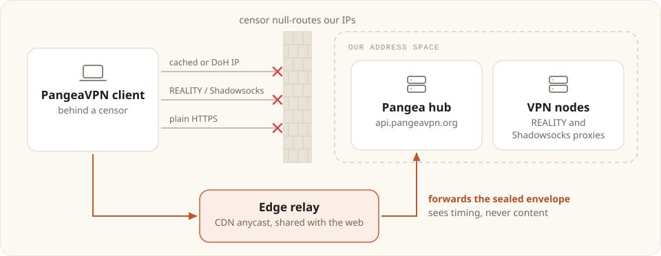

# Edge relay

A Cloudflare Worker that takes the hub's sealed envelope on `/v1/secure` or
`/v2/secure` and forwards it to the same route on `api.pangeavpn.org`. It's
what the client's `fronted` hub method talks to.

Current clients pin a post-quantum key and send `/v2/secure` whenever their
daemon can encapsulate, so a relay that forwarded only `/v1/secure` would be
useless to them.

## Why it exists

The client has other ways to reach the hub (see `ensureHub` in
[`pangeaApiClient.ts`](../../apps/desktop/src/main/pangeaApiClient.ts)): a
cached IP, a DoH-resolved IP with no SNI, the daemon's REALITY and Shadowsocks
proxies, and plain HTTPS. Between them they get past DNS poisoning, SNI blocking
and a blackholed hub IP.

What they can't get past is enumeration. Every one of them ends on address space
we own, so a censor who sweeps our IPs and null-routes them takes out every path
at once. The client can't provision anything, even though nothing about the
protocol was ever detected. The relay's address belongs to the CDN and is shared
with a large slice of the web, so blocking it is expensive in a way that blocking
our own /24 isn't.

<picture>
  <source media="(prefers-color-scheme: dark)" srcset="../../docs/assets/edge-relay-dark.svg" />
  
</picture>

## Why it's safe on someone else's infrastructure

Every request is an envelope sealed against the hub's pinned keys
(`SERVER_PUBLIC_KEY_B64` and, for v2, `SERVER_KEM_PUBLIC_KEY_B64` in
[`secureChannel.ts`](../../apps/desktop/src/main/secureChannel.ts)), with a
fresh ephemeral client key for each request. TLS is only the carrier. That's
also why the direct-IP path with no SNI can set `rejectUnauthorized: false`
without weakening anything.

So Cloudflare terminating TLS in the middle gains it nothing. It relays
ciphertext it can't read, and it can't forge a reply. What it *can* see is the
timing and volume of the traffic, and that a given client IP talks to this
relay. That's why `fronted` is tried after our own paths, not before them.

## Deploy

```sh
cd infra/edge-relay
npx wrangler deploy
```

Note the hostname it prints (`pangea-edge-relay.<subdomain>.workers.dev`).

> [!TIP]
> Deploy **more than one**, on separate accounts and ideally on separate CDNs.
> The client rotates through its list and promotes whichever relay answers, so a
> burned relay costs one failed probe instead of the whole method. Give each
> deployment its own `name` in `wrangler.toml`.

> [!WARNING]
> If you put a relay on a custom domain, don't pick a name that looks like ours.
> The keyword rule that blocks `pangeavpn.org` will block `pangea-relay.dev`
> just as easily, and you'll have paid for a relay that fails in exactly the
> conditions it exists for.

The tests use Node's built-in runner and stub out the network:

```sh
node --test infra/edge-relay/worker.test.mjs
```

## Telling clients about it

Clients learn about relays in three ways:

1. **From the hub.** Return the hostnames as `frontedEndpoints` on
   `/api/client/bootstrap` and in the token-login response. The client validates
   them (host only, with no scheme, port or path), caches them in
   `settings.json`, and refreshes them on every login. This is how a rotation
   reaches existing installs without a release.

2. **Shipped with the app**, for the cold start. A client that has never reached
   the hub has nothing cached, so a brand-new install behind a block would have
   no relay at all. `DEFAULT_FRONTED_ENDPOINTS` in
   [`frontedEndpoints.ts`](../../apps/desktop/src/shared/frontedEndpoints.ts)
   fills that gap until the hub's list replaces it.

3. **By hand**, in `settings.json`:

   ```json
   { "frontedEndpoints": ["pangea-edge-relay.example.workers.dev"] }
   ```

If the list ever ends up empty, the method does nothing. `tryFrontedPath` logs
`no relay configured` and `ensureHub` moves straight on to the next method.

## Operational notes

**The hub sees Cloudflare's IPs, not the client's.** The Worker deliberately
forwards no `CF-Connecting-IP` or `X-Forwarded-For`, so the relay tells the hub
nothing about who's calling.

That has a cost. `app.js` mounts `clientRateLimit` (30 requests a minute per
source address) ahead of both secure routes, so every client on one relay shares
the budget of Cloudflare's egress address, and heavy use throttles all of them
together. The inner request the hub re-dispatches is skipped, so each envelope
only counts once. If this becomes a problem, exempt the relay on the hub side.
Don't forward the client address, because keeping it off the wire is the whole
point of this path.

The Worker's only limits on its own side are that it accepts POST only, on those
two routes, with bodies up to 64 KB.

**Cost.** The relay carries control-plane traffic only (login, regions, key
registration). No tunnel data ever crosses it. The free tier is far more than
enough, and if the relay ever shows meaningful volume, something is
misconfigured.
